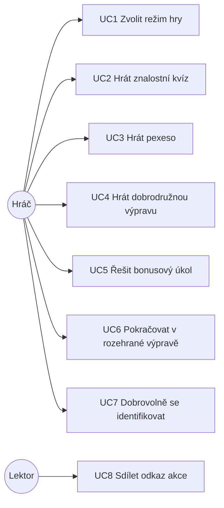

# Labyrinty kritického myšlení – analýza funkčních požadavků

| | |
|---|---|
| Software | Labyrinty kritického myšlení (Lakrim) |
| Verze dokumentu | 1.0, září 2026 |
| Odpovídá stavu kódu | větev `master`, commit `4d77d2e` (13. 8. 2026) |
| Související dokumenty | Technická dokumentace (`docs/technicka-dokumentace.md`), uživatelská příručka, popis ověření funkčnosti |

## 1. Úvod

### 1.1 Účel

Dokument shrnuje funkční a nefunkční požadavky na software Labyrinty kritického myšlení,
jejich zdroj, prioritu a stav naplnění ve výsledné aplikaci. Slouží jako podklad pro
vykázání výsledku a jako zadání pro další rozvoj.

### 1.2 Kontext a cíl

Senioři patří mezi nejohroženější skupiny digitálních podvodů (phishing jménem banky,
„vnuk v nesnázích“, falešné e-shopy, investiční a romantické podvody, hoaxy). Klasické
osvětové materiály mají omezený účinek, protože nepracují s nácvikem reakce v situaci.
Cílem softwaru je:

1. **vzdělávat** seniory nácvikem reakce na realistické modelové situace s okamžitou
   vysvětlující zpětnou vazbou,
2. **měřit** úroveň a vývoj schopnosti rozpoznat riziko (čas, správnost, pokusy) pro
   výzkumné vyhodnocení projektu,
3. **udržet pozornost** cílové skupiny herními prvky přiměřenými věku (příběh, sbírání,
   odměny, oddechové úkoly), bez stresu z chyby.

### 1.3 Vývoj požadavků

Požadavky vznikaly iterativně ve třech etapách, což odpovídá třem režimům hry:

| Etapa | Období | Výstup | Poznatek, který vedl k další etapě |
|---|---|---|---|
| 1 | 08/2024 – 01/2025 (vydání 1.0) | Lineární znalostní kvíz (verze 1) | Kvíz měří znalosti, ale nevytváří motivaci pokračovat a všem dává stejně těžké otázky. |
| 2 | 05/2025 – 04/2026 (vydání 2.0–2.6.1) | Pexeso s odkrývaným obrazem (verze 2), otázky s více správnými odpověďmi, druhý pokus, události kvízu | Vizuální odměna funguje; chybí příběh, přizpůsobení obtížnosti a možnost hru přerušit a vrátit se. |
| 3 | 05/2026 – 08/2026 | Dobrodružná výprava (verze 3): mapa ostrovů, adaptivní obtížnost, karty bezpečí, průvodce, bonusy, obnovení hry | Příprava nasazení v kurzech AU3V (události založeny 07/2026). |

## 2. Zainteresované strany a aktéři

| Aktér | Zájem / role | Interakce se systémem |
|---|---|---|
| **Hráč (senior, respondent)** | Bezpečně se naučit rozpoznat podvod; nebýt zahlcen ani ponížen chybou. | Hraje bez registrace, volí režim, odpovídá, čte zpětnou vazbu, sbírá karty, přerušuje a pokračuje. |
| **Lektor / organizátor kurzu (AU3V, U3V)** | Použít hru na přednášce či v kurzu a vidět výsledky své skupiny. | Rozdá odkaz s identifikátorem akce; nemá vlastní rozhraní. |
| **Výzkumník / řešitel projektu** | Získat data o chování respondentů pro vyhodnocení. | Pracuje s uloženými daty mimo veřejnou část aplikace. |
| **Autor obsahu (odborný tým CMTF)** | Dodat scénáře, otázky, vysvětlení a karty bezpečí. | Předává scénáře; do systému je vkládá vývojář datovými migracemi. |
| **Vývojář / správce** | Udržovat a rozvíjet aplikaci, nasazovat obsah. | Kód, migrace, CI, provoz. |
| **Poskytovatel podpory (TA ČR)** | Ověřitelný, dokumentovaný a funkční výsledek. | Dokumentace, video, veřejný odkaz. |

## 3. Rozsah systému

**Součástí systému je:** veřejná webová hra ve třech režimech, anonymní evidence
respondentů a jejich odpovědí, seskupení podle akcí, správa obsahu formou verzovaných
datových migrací.

**Součástí systému není:** správa uživatelských účtů hráčů, redakční rozhraní pro autory
obsahu, statistické vyhodnocení dat (probíhá mimo systém), jazykové verze
mimo češtinu.

## 4. Případy užití

### UC1 Zvolit režim hry
- **Aktér:** hráč. **Vstup:** úvodní stránka `/`, případně odkaz akce.
- **Průběh:** hráč vidí doporučenou cestu (výprava) a dvě alternativy (kvíz, pexeso)
  s odhadem délky; má-li rozehranou výpravu, nabídne se pokračování i restart.
- **Výsledek:** založení respondenta v zvoleném režimu s vazbou na akci, je-li v URL.

### UC2 Hrát znalostní kvíz
- **Průběh:** systém postupně předkládá otázky (výchozí 15), hráč volí jednu možnost,
  ihned vidí vyhodnocení své volby (a volitelně i ostatních), ukazatel průběhu zobrazuje
  témata a jejich úspěšnost. Po poslední otázce následuje dobrovolná identifikace (UC7)
  a závěrečné shrnutí: úspěšnost v procentech a seznam „co zvládáte / na co si dát pozor“.
- **Výjimky:** vyčerpané otázky → hlášení `maximum_questions_exceeded`.

### UC3 Hrát pexeso
- **Průběh:** 16 políček; hráč otočí políčko, zobrazí se situace; u otázek s více
  správnými odpověďmi musí označit všechny správné; má druhý pokus. Za správnou odpověď
  se odkryje dílek výsledného obrazu. Po odkrytí všeho následuje dokončení.

### UC4 Hrát dobrodružnou výpravu
- **Předpoklad:** hráč prošel nebo přeskočil úvodní prohlídku (tour).
- **Průběh:**
  1. Hráč vybere ostrov na mapě; průvodce ostrova pronese úvod.
  2. Klikne na odemčený kámen; systém vybere situaci v obtížnosti odpovídající jeho
     dosavadním výsledkům (ze všech ostrovů) a zobrazí zadání, případně s obrázky a odpočtem.
  3. Hráč zvolí reakci. Správně → kámen zezelená, hráč dostane kartu bezpečí, odemkne se
     další kámen. Špatně poprvé → vysvětlení, kámen oranžový, druhý pokus bez zvolené
     možnosti. Špatně podruhé (nebo vypršel čas) → závěrečné vysvětlení, kámen červený,
     další kámen se přesto odemkne.
  4. Po sérii správných odpovědí systém místo běžné otázky občas nabídne bonusovou.
  5. Hráč kdykoli otevře maják: karty bezpečí, důležité kontakty (Policie ČR, Linka seniorů,
     Linka pomoci obětem, infolinka banky), koš ulovených rybek.
  6. Po projití všech kamenů všech ostrovů se zobrazí závěrečný panel s videem a shrnutím
     „Kapitánova cesta“.
- **Výsledek:** uložené odpovědi s kontextem kamene, splněné situace, stav v session.

### UC5 Řešit bonusový úkol (easter egg)
- **Průběh:** hráč klikne na rybku v moři; otevře se oddechový úkol (např. hledání rozdílů),
  po zavření se zobrazí řešení, rybka je „ulovena“ a přesune se do koše v majáku, odkud lze
  úkol znovu prohlížet. Každý úkol lze splnit jednou.

### UC6 Pokračovat v rozehrané výpravě
- **Průběh:** hráč odejde na úvodní stránku nebo zavře prohlížeč a vrátí se ve stejné
  relaci; systém rozpozná rozehraného respondenta a obnoví stav kamenů, karty a rybky.
  Volbou „Začít znovu“ založí čistý běh.

### UC7 Dobrovolně se identifikovat
- **Průběh:** po dokončení kvízu hráč může zadat pohlaví a věkovou skupinu
  (< 65, 65–69, 70–74, 75–79, 80+); vše lze přeskočit. Volitelně, je-li zapnuto v nastavení,
  studijní číslo.

### UC8 Sdílet odkaz akce
- **Průběh:** lektor obdrží od správce odkaz ve tvaru `/ostrov/{hash}` (resp. `/kviz/…`,
  `/pexeso/…`) a rozdá ho účastníkům; všichni respondenti z odkazu nesou vazbu na akci.

## 5. Funkční požadavky

Priorita: **M** (must, nezbytné), **S** (should, důležité), **C** (could, vhodné).
Stav: ✅ implementováno, ◐ částečně, ✗ neimplementováno. Sloupec *Ověření* odkazuje na
automatizované testy, kde existují.

### 5.1 Společné jádro

| ID | Požadavek | Priorita | Stav | Implementace / ověření |
|---|---|---|---|---|
| FR-01 | Hráč hraje bez registrace; systém ho identifikuje náhodným tokenem platným pro jeden běh. | M | ✅ | `Web\*\HomepageController`, `RunTest` |
| FR-02 | Každý běh nese režim (verzi) a volitelnou vazbu na akci z URL. | M | ✅ | `respondents.version`, `quiz_event_id`, `RunTest::testSuccessfulWithEvent` |
| FR-03 | Systém ukládá každou zvolenou možnost s časem od zobrazení otázky a pořadím pokusu. | M | ✅ | `respondents_answers`, `AnswerTest` |
| FR-04 | Otázky mají 1–3 obtížnost, typ (jedna / více voleb), možnosti s příznakem správnosti a individuálním vysvětlením. | M | ✅ | modely `Question`, `QuestionOption` |
| FR-05 | Otázka může mít více správných možností; odpověď je správná, pokud hráč zvolil pouze správné. | M | ✅ | `IslandGame\AnswerTest::testAnswerWithOneOfMultipleRightOptionsIsCorrect` |
| FR-06 | Texty otázek a úkolů mohou obsahovat obrázky vkládané zástupnou značkou. | S | ✅ | `QuestionImageTest` |
| FR-07 | Po prvním a druhém neúspěšném pokusu se zobrazí odlišné vysvětlení. | M | ✅ | `first_/second_wrong_answer_evaluation`, `AnswerController` |
| FR-08 | Systém označí běh za dokončený po zodpovězení stanoveného počtu otázek. | M | ✅ | `RespondentAnswerObserver`, `AnswerTest::testStoreLastAnswer` |
| FR-09 | Hráč může dobrovolně uvést pohlaví a věkovou skupinu; obojí lze přeskočit. | S | ✅ | `RespondentIdentificationTest` |
| FR-10 | Volitelně lze vyžadovat studijní číslo (nasazení ve výuce). | C | ✅ | `storeStudentId`, nastavení `requireStudentId` |
| FR-11 | Veškeré uživatelské texty jsou česky a srozumitelné pro laiky. | M | ✅ | `resources/lang/cs`, `i18n/locales/cs.js` |

### 5.2 Znalostní kvíz (verze 1)

| ID | Požadavek | Priorita | Stav | Implementace / ověření |
|---|---|---|---|---|
| FR-20 | Kvíz předkládá pevně danou sadu otázek popořadě (volitelně náhodně). | M | ✅ | `QuizQuestionService`, `QuestionTest` |
| FR-21 | Počet otázek a míchání jsou konfigurovatelné bez zásahu do kódu. | S | ✅ | tabulka `difficulty` |
| FR-22 | Po odpovědi hráč vidí vyhodnocení své volby, volitelně i ostatních možností. | M | ✅ | `show_evaluations_for_other_options` |
| FR-23 | Ukazatel průběhu zobrazuje témata otázek a jejich stav (správně / špatně). | S | ✅ | `ProgressBar.vue`, `QuizStatusBarStore` |
| FR-24 | Závěrečné shrnutí: úspěšnost a seznam zásad, které hráč zvládá / na které si má dát pozor. | M | ✅ | `RespondentSummaryTest`, `Statistics`, `getFinalSummary()` |
| FR-25 | Kvíz nelze pokračovat po vyčerpání otázek; systém to srozumitelně sdělí. | M | ✅ | `QuestionTest::testItThrownMaximumQuestionsExceededException` |

### 5.3 Pexeso (verze 2)

| ID | Požadavek | Priorita | Stav | Implementace / ověření |
|---|---|---|---|---|
| FR-30 | Herní pole 16 políček, každé skrývá otázku. | M | ✅ | `QuestionsTiles.vue`, `maxTiles` |
| FR-31 | Za správnou odpověď se odkryje dílek výsledného obrazu; po odkrytí všech je hra dokončena. | M | ✅ | Livewire `RevealingImage` |
| FR-32 | Otázky s více správnými odpověďmi vyžadují označit všechny; shrnutí uvádí „x z y“. | M | ✅ | `QuestionType::MultiSelect`, `settings.multiselectSummary` |
| FR-33 | Hráč má u otázky druhý pokus. | S | ✅ | `QuestionsTilesStore.answerAttempt` |
| FR-34 | Nadpis a instrukce nad možnostmi jsou konfigurovatelné per otázka. | C | ✅ | `settings.actionTitle`, `actionPerex` |

### 5.4 Dobrodružná výprava (verze 3)

| ID | Požadavek | Priorita | Stav | Implementace / ověření |
|---|---|---|---|---|
| FR-40 | Herní mapa se 4 tematickými ostrovy, každý s 5 kameny (situacemi) a vlastním průvodcem. | M | ✅ | `islands`, `situations`, `IslandMap.vue` |
| FR-41 | Kameny ostrova se odemykají postupně; odemčení dalšího nezávisí na správnosti. | M | ✅ | `assets.js` stavy kamenů |
| FR-42 | Na každý kámen připadá baterie situací ve třech obtížnostech. | M | ✅ | seedy situací, 15 situací na ostrov |
| FR-43 | Systém volí obtížnost situace adaptivně podle dosavadních výsledků hráče napříč ostrovy; jedna chyba nesmí srazit hráče na nejlehčí úroveň, opakované chyby úroveň snižují. | M | ✅ | `SituationSelector`, `SituationTest` (7 scénářů) |
| FR-44 | Není-li situace v cílové obtížnosti k dispozici, použije se nejbližší (přednostně nižší). | M | ✅ | `SituationTest::testFallsBackToNearestLowerDifficultyWhenTargetUnavailable` |
| FR-45 | Za sérii správných odpovědí systém nabídne bonusovou otázku, nejvýše dvakrát za hru, rozloženě. | S | ✅ | `SituationTest::testServesBonusQuestionAfterCorrectStreak`, `…AtMostTwoBonusesPerGame` |
| FR-46 | Správně vyřešená situace udělí kartu bezpečí; karty jsou dostupné na nástěnce v majáku. | M | ✅ | `situations.safety_card`, `IslandGame\AnswerTest::testCorrectAnswerCompletesSituationAndReturnsSafetyCard` |
| FR-47 | Bonusová otázka bez vlastní karty udělí univerzální kartu. | C | ✅ | `AnswerController::BONUS_SAFETY_CARD` |
| FR-48 | Situace může mít časový limit s viditelným odpočtem; vypršení se počítá jako neúspěšný pokus. | S | ✅ | `settings.time_limit`, `useQuestionFlow.handleTimeUp` |
| FR-49 | Průvodce komentuje úvod ostrova, úspěch, druhý pokus i neúspěch; kliknutím na průvodce lze úvod zopakovat. | S | ✅ | `useGuide`, `GuideBubble.vue` |
| FR-50 | Úvodní interaktivní prohlídka vysvětlí ovládání; lze ji přeskočit a kdykoli znovu spustit („Jak hrát?“). | S | ✅ | `IntroTour.vue` |
| FR-51 | Maják obsahuje důležité kontakty (linky pomoci, policie) dostupné kdykoli během hry. | M | ✅ | `ContactsModal.vue` |
| FR-52 | Vyřešené kameny lze znovu prohlížet v režimu čtení. | C | ✅ | `useQuestionFlow.reviewMode` |
| FR-53 | Hráč může hru přerušit a ve stejné relaci pokračovat; úvodní stránka nabídne pokračování i restart. | M | ✅ | `IslandGame\HomepageController`, `useIslands` (localStorage) |
| FR-54 | Po dokončení všech kamenů se zobrazí závěrečný panel s videem a shrnutím cesty. | S | ✅ | `GameCompleteModal.vue` |
| FR-55 | Systém eviduje splněné situace respondenta pro obnovení postupu a vyhodnocení. | M | ✅ | `respondent_situations`, `RespondentSituationsTest` |

### 5.5 Bonusové úkoly (easter eggy)

| ID | Požadavek | Priorita | Stav | Implementace / ověření |
|---|---|---|---|---|
| FR-60 | V moři plavou rybky, jedna na každý bonusový úkol; kliknutím se úkol otevře. | S | ✅ | `SeaFishLayer.vue`, `useSeaFish` |
| FR-61 | Každý úkol lze splnit jednou; po splnění je dostupný k prohlížení v koši. | S | ✅ | `EasterEggTest`, `RespondentEasterEggTest` |
| FR-62 | Systém ukládá čas strávený v úkolu. | C | ✅ | `respondent_easter_eggs.seconds` |
| FR-63 | Zadání i řešení mohou obsahovat obrázky. | S | ✅ | `EasterEggTest::testRendersImagePlaceholdersInDescriptionAndEvaluation` |

### 5.6 Sběr dat a obsah

| ID | Požadavek | Priorita | Stav | Implementace / ověření |
|---|---|---|---|---|
| FR-70 | Respondenty lze seskupit podle akce (přednášky, kurzu) pomocí identifikátoru v odkazu. | M | ✅ | `quiz_events`, migrace 20 událostí AU3V |
| FR-72 | Uložená data lze převést do tabulkové podoby (řádek na respondenta, sloupce na otázky a možnosti, časy odpovědí, demografie) pro statistické zpracování. | M | ✅ | interní nástroj mimo veřejnou část |
| FR-75 | Herní obsah je verzovaný spolu s kódem a nasazuje se reprodukovatelně. | M | ✅ | datové migrace s `up()`/`down()` |
| FR-76 | Tabulkový výstup odpovědí z výpravy obsahuje kontext (ostrov, kámen, pokus). | S | ◐ | data se ukládají (`island_id`, `button`, `attempt`); výstup zatím kontext nezobrazuje |
| FR-77 | Redakční rozhraní pro autory obsahu (bez zásahu vývojáře). | C | ✗ | mimo rozsah; obsah přes migrace |

## 6. Nefunkční požadavky

| ID | Oblast | Požadavek | Stav / řešení |
|---|---|---|---|
| NFR-01 | Použitelnost pro seniory | Velké ovládací prvky a písmo, vysoký kontrast, jeden úkol na obrazovku, srozumitelné texty, průvodce, možnost druhého pokusu bez penalizace, žádný časový tlak mimo výslovně nastavené situace. | ✅ návrh UI, Tailwind, `IntroTour`, `GuideBubble` |
| NFR-02 | Responzivita | Hra funguje na počítači, tabletu i mobilu na výšku a naležato. | ✅ úpravy pro mobil naležato, 2×2 mřížka ostrovů |
| NFR-03 | Přístupnost | Ikonová tlačítka mají textové popisky (`aria-label`), obrázky alternativní text, obrázky lze zvětšit. | ◐ základní úroveň; audit WCAG neproveden |
| NFR-04 | Výkon | Plynulá odezva při zátěži běžného kurzu (desítky souběžných hráčů); dotazy omezené na jednoho respondenta a jeden kámen. | ◐ návrh dotazů, WebP grafika, Vite build; zátěžové měření není součástí testů |
| NFR-05 | Soukromí | Žádná registrace; osobní údaje pouze dobrovolné a nepřímé (pohlaví, věková skupina, studijní číslo); respondenta identifikuje náhodný token. | ✅ |
| NFR-06 | Bezpečnost | Validace všech vstupů, CSRF ochrana, hlášení chyb do Sentry. | ✅ |
| NFR-07 | Integrita dat | Odpověď nelze přiřadit k cizí otázce; splnění situace a bonusu je idempotentní (updateOrCreate). | ✅ validační pravidla, unikátní indexy |
| NFR-08 | Udržovatelnost | Statická analýza na nejvyšší úrovni, jednotný styl kódu, testy nad všemi endpointy, CI nad každým PR. | ✅ PHPStan max, PHPCS, PHPUnit, GitHub Actions |
| NFR-09 | Rozšiřitelnost obsahu | Přidání ostrova, situace nebo otázky nevyžaduje změnu aplikační logiky. | ✅ datově řízené, `settings` JSON |
| NFR-10 | Konfigurovatelnost pravidel | Parametry adaptivity (prahy skóre a série, počet bonusů) soustředěné na jednom místě. | ✅ konstanty `SituationSelector` |
| NFR-11 | Nasazení | Standardní LAMP/LEMP stack, jeden příkaz pro schéma i obsah, kontejnerizované vývojové prostředí. | ✅ `artisan migrate`, Laravel Sail |
| NFR-12 | Lokalizace | Čeština; texty oddělené od kódu tak, aby šla přidat další jazyková verze. | ◐ vue-i18n a `lang/cs`; část textů kvízu a pexesa je v komponentách |
| NFR-13 | Právní rámec | Prohlášení o fiktivnosti obsahu a použití generativní AI při tvorbě podkladů je viditelné v aplikaci. | ✅ patička |

## 7. Datové požadavky

Systém musí pro výzkumné vyhodnocení uchovat u každé odpovědi: identifikátor běhu
(respondenta), režim, akci, otázku a zvolené možnosti, správnost, váhu, čas od zobrazení
otázky, pořadí pokusu, u výpravy ostrov a kámen; u respondenta dobrovolné pohlaví
a věkovou skupinu, příznak dokončení a čas vzniku; dále splněné situace a bonusové úkoly
s časy. Všechny tyto položky jsou v datovém modelu (viz technická dokumentace, kap. 4).

## 8. Omezení a předpoklady

- Cílové prostředí jsou aktuální verze běžných prohlížečů (Chrome, Firefox, Safari, Edge)
  s podporou ES2018+ a WebP.
- Obnovení výpravy je vázané na relaci prohlížeče (session cookie a localStorage);
  napříč zařízeními se neobnovuje, což je záměr vzhledem k absenci účtů.
- Obsah situací vychází z obecných principů podvodných praktik; všechny subjekty jsou
  fiktivní (prohlášení v patičce).
- Statistické zpracování dat probíhá mimo systém.

## 9. Sledovatelnost požadavků na testy

| Oblast | Testy |
|---|---|
| Adaptivní výběr, bonusy | `tests/Feature/Web/IslandGame/SituationTest.php` (11 testů) |
| Odpověď ve výpravě, karty bezpečí | `tests/Feature/Web/IslandGame/AnswerTest.php` (6) |
| Kvíz: otázky, odpovědi, shrnutí, identifikace, věk | `tests/Feature/Web/Quiz/{QuestionTest,AnswerTest,RespondentSummaryTest,RespondentIdentificationTest,AgeListTest,RunTest}.php` |
| Postup respondenta | `tests/Feature/Web/Quiz/RespondentSituationsTest.php` (6) |
| Bonusové úkoly | `tests/Feature/Web/Quiz/{EasterEggTest,RespondentEasterEggTest}.php` (12) |
| Obrázky v textu | `tests/Feature/Web/Quiz/QuestionImageTest.php` (10) |
| Výčty | `tests/Unit/Enums/*` |

Celkem 99 automatizovaných testů; spouštějí se v CI nad každým pull requestem.

## 10. Otevřené body pro další rozvoj

1. Doplnit do vyhodnocení kontext výpravy (ostrov, kámen, pokus) a členění podle akce (FR-76).
2. Redakční rozhraní pro autory obsahu (FR-77).
3. Audit přístupnosti podle WCAG 2.1 AA a jeho zapracování (NFR-03).
4. Sjednotit lokalizaci kvízu a pexesa do vue-i18n (NFR-12).
5. Označit vydání verze 3 git tagem pro jednoznačnou identifikaci výsledku.
