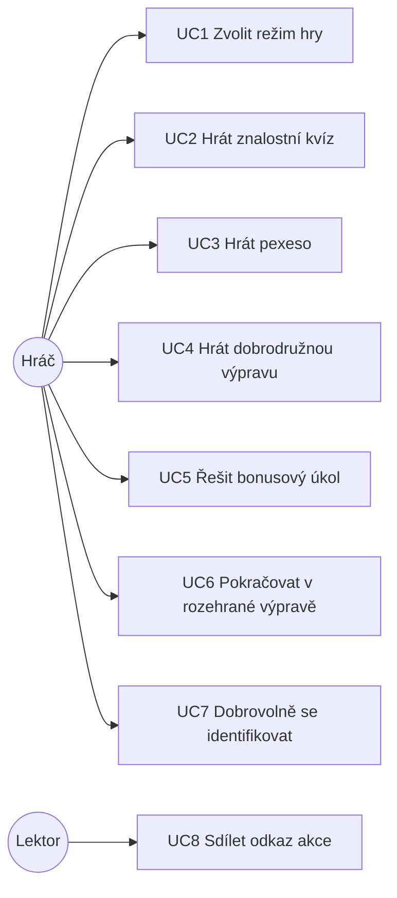

# Labyrinty kritického myšlení – analýza funkčních požadavků

| | |
|---|---|
| Software | Labyrinty kritického myšlení (LAKRIM) |
| Verze softwaru | LAKRIM 3.9 (git tag `3.9`, větev `master`, září 2026) |
| Verze dokumentu | 1.4, září 2026 (1.2: zapracováno posouzení dokumentace; 1.3: doplněny výsledky statistiky adaptivity z provozních dat; 1.4: upřesněna úspěšnost odpovědí podle obtížnosti) |
| Repozitář | https://github.com/upol-cmtf/lakrim (veřejný; kód pod licencí MIT, vzdělávací obsah pod CC BY 4.0) |
| Související dokumenty | Technická dokumentace (`docs/technicka-dokumentace.md`), Programátorská dokumentace (`docs/programatorska-dokumentace.md`), uživatelská příručka, popis ověření funkčnosti |

## 1. Úvod

### 1.1 Účel

Dokument shrnuje funkční a nefunkční požadavky na software Labyrinty kritického myšlení,
jejich zdroj, prioritu a stav naplnění ve výsledné aplikaci. Slouží jako podklad pro
vykázání výsledku a jako zadání pro další rozvoj.

### 1.2 Kontext a cíl

Senioři patří mezi nejohroženější skupiny digitálních podvodů (phishing jménem banky,
„vnuk v nesnázích“, falešné e-shopy, investiční a romantické podvody, hoaxy). Klasické
osvětové materiály mají omezený účinek, protože nepracují s nácvikem reakce v situaci.
Cílem softwaru je:

1. **vzdělávat** seniory nácvikem reakce na realistické modelové situace s okamžitou
   vysvětlující zpětnou vazbou,
2. **měřit** úroveň a vývoj schopnosti rozpoznat riziko (čas, správnost, pokusy) pro
   výzkumné vyhodnocení projektu,
3. **udržet pozornost** cílové skupiny herními prvky přiměřenými věku (příběh, sbírání,
   odměny, oddechové úkoly), bez stresu z chyby.

### 1.3 Vývoj požadavků a technického řešení

Požadavky i technické řešení vznikaly iterativně. Tři etapy odpovídají třem režimům hry;
třetí etapa má navíc několik vývojových kroků, ve kterých se měnil adaptivní algoritmus
a pravidla zpětné vazby. Sloupec *Doklad* odkazuje na git historii repozitáře (tagy vydání, historie
souborů, pull requesty) a na automatizované testy. Uživatelské testování a provozní ověření
shrnuje kap. 1.7; jejich podklady jsou v přílohách projektové dokumentace (ISTA), nikoli
v repozitáři.

| Etapa | Období | Výchozí stav | Zjištěný problém | Provedená změna | Doklad |
|---|---|---|---|---|---|
| 1 – Kvíz (verze 1) | 08/2024 – 07/2025, vydání 1.0 až 1.6.1 | Lineární kvíz 15 otázek v pevném pořadí, jednotná obtížnost, jeden pokus, vyhodnocení zvolené možnosti. | Po nasazení v kurzech AU3V (identifikace studijním číslem, export výsledků pro výzkumný tým) řešitelský tým vyhodnotil, že kvíz měří znalosti, ale nevytváří motivaci pokračovat, nabízí všem stejně těžké otázky a po chybě nedává možnost odpověď opravit. Vyplněné dotazníky byly výzkumnému týmu předány exportem podle studijního čísla; podrobné výsledky vyhodnocení dat verze 1 nejsou součástí tohoto repozitáře a eviduje je odborný tým projektu. | Zadání režimu s vizuální odměnou (pexeso) a s druhým pokusem. | tagy `1.0`–`1.6.1`; git historie: identifikace studijním číslem (01/2025), export výsledků (04/2025) |
| 2 – Pexeso (verze 2) | 05/2025 – 04/2026, vydání 2.0 až 2.6.1 | 16 políček, odkrývaný obraz, jeden pokus, jedna správná možnost. | Během vývoje: jeden pokus neumožňoval chybu opravit a zpětná vazba nerozlišovala první a druhý omyl. Po nasazení: podle zpětné vazby odborného týmu vizuální odměna funguje, ale chybí příběh, přizpůsobení obtížnosti a možnost hru přerušit a vrátit se. Připomínky byly předávány průběžně a neformálně, bez písemného protokolu. | Otázky s více správnými možnostmi; druhý pokus a dvě samostatná vysvětlení (`first_/second_wrong_answer_evaluation`, sloupec `attempt`). Zadání dobrodružné výpravy. | tagy `2.0`–`2.6.1`; git historie: ukládání více zvolených možností (07/2025), druhý pokus a dvojí vysvětlení (08/2025) |
| 3a – Výprava, prototyp | 01/2026 – 05/2026 | Mapa moře s ostrovy (01/2026). Prvních 7 testů a první výběr situace: cílová obtížnost podle **série** správných odpovědí v řadě (prahy 2 a 4), chyba sérii nuluje. Jeden pokus na kámen. Odpověď správná jen při výběru **všech** správných možností. | Po importu skutečných scénářů odborného týmu (05/2026) se ukázalo, že situace mají více přijatelných reakcí. Při hraní prototypu jediná chyba shodila hráče z obtížnosti 3 rovnou na 1; toto chování bylo zachyceno i testem `testWrongAnswerResetsDifficultyToEasy`. | Pravidlo správnosti změněno na „zvoleny pouze správné možnosti“. Série ponechána jako prozatímní varianta k dalšímu ověření. | git historie `SituationSelector` (první verze, 05/2026) a `SituationTest`; datové migrace prvních situací ze scénářů |
| 3b – Výprava, zpětná vazba | 05/2026 | Situace se po odpovědi uzavřela; špatná odpověď neměla pokračování. | Požadavek řešitelského týmu: cílová skupina potřebuje bezpečné prostředí pro chybu, tedy druhý pokus, vysvětlení po každém pokusu a průchod, který se při neúspěchu nezablokuje. | Dvoupokusový průběh: kámen oranžový po 1. chybě (druhý pokus), červený po 2. chybě s odemčením dalšího kamene; průvodce se stavy úspěch / zkus znovu / neúspěch; karta bezpečí jako sběratelský prvek. | git historie frontendu výpravy a `AnswerController` (05/2026) |
| 3c – Výprava, adaptivita | 06/2026 | Varianta A (série). | Série trestá jednu chybu stejně jako řadu chyb a při volném pořadí ostrovů dává nestabilní průchod (rozbor a simulace v technické dokumentaci, kap. 12.2). | **Varianta B:** globální kumulativní skóre ze všech prvních pokusů napříč ostrovy, +1 / −1, dolní mez 0, prahy 2 a 4 ponechány. Test opačného chování nahrazen testem `testSingleWrongAnswerDoesNotDropDifficultyToEasy`; přidány testy postupného snižování, dolní meze a započítání všech ostrovů. Současně obnovení rozehrané hry ze session. | git historie `SituationSelector` a `SituationTest` (06/2026); `SituationTest` rozšířen ze 7 na 11 testů (po doplnění bonusů 14, kap. 9) |
| 3d – Výprava, bonusy a obsah | 06/2026 | Bonusové („bezpečné“) otázky byly součástí baterie kamenů. | Bonusové otázky nemají kartu bezpečí ani místo v příběhu ostrova a jejich neřízené nabízení by narušovalo srovnatelnost průchodů. Podle pilotního odehrání zástupci cílové skupiny (kap. 1.7) hráči postupují plynule; řešitelský tým proto rozhodl, že bonusy mají přicházet až po sérii úspěchů. Finální scénáře odborného týmu vyžadovaly kompletní reimport obsahu. | Bonus jako odměna za sérii 3 a 6 správných odpovědí, nejvýše 2× za hru; univerzální karta bezpečí za bonus; smazání a reimport všech otázek verze 3 ze scénářů. | git historie `SituationSelector` a `AnswerController`, datové migrace reimportu otázek verze 3 (06/2026); pull request `feature/v3-final` |
| 3e – Vydání, nasazení a provozní ověření | 06/2026 – 09/2026 | Vydání 3.0 (06/2026) se všemi třemi režimy. | Provozní ověření v kurzech U3V (07–08/2026, kap. 1.7) potvrdilo dokončitelnost hry a chování adaptivity v reálném prostředí; příprava kurzů AU3V (20 událostí), výměna videa bonusového úkolu. Pro doložení adaptivity na provozních datech chyběla statistika přechodů mezi obtížnostmi. | Export výsledků podle událostí; statistika přechodů mezi obtížnostmi a reakce na chybu v `stats:island-game`; licenční soubory (09/2026). | tagy `3.0`–`3.9`; datová migrace událostí kvízu AU3V (07/2026); git historie `GameStatistics` (09/2026) |

### 1.4 Technický problém a výchozí nejistota

Vývoj softwaru řešil technický problém, jak v jedné webové aplikaci propojit adaptivní
výběr vzdělávacích situací, volný průchod nelineárním herním prostředím a výzkumně
využitelný sběr dat. Hráč si může samostatně volit tematické ostrovy, a proto nelze
obtížnost určovat pouze podle pevného pořadí úloh ani podle výsledků dosažených v jednom
tematickém okruhu.

Technická nejistota spočívala v tom, zda lze na základě krátké a proměnlivé historie
hráče bez registrace (nejvýše 20 kamenů, žádný účet, žádná předchozí data o hráči) průběžně
odhadovat vhodnou obtížnost dalších situací tak, aby jedna chybná odpověď nevedla
k nepřiměřenému snížení obtížnosti, opakované chyby však vyvolaly postupné zjednodušení
úloh. Současně bylo nutné zachovat reprodukovatelné ukládání odpovědí napříč třemi
odlišnými herními režimy a vytvořit prostředí, které hráče z cílové skupiny nebude
penalizovat ani blokovat při neúspěchu.

Tento soubor požadavků nebylo možné naplnit pouhým použitím standardního lineárního
kvízu (etapa 1) ani jeho vizuálním obohacením (etapa 2). Vyžadoval návrh vlastního
mechanismu výběru situací, společného událostního datového modelu odpovědí a pravidel
pro propojení adaptivity, zpětné vazby a herního postupu. Že první navržený mechanismus
(varianta A, kap. 1.5) nebyl vhodný a musel být nahrazen, je samo dokladem této nejistoty.

### 1.5 Zvažované varianty řešení

Tabulka uvádí varianty, které byly při vývoji realizovány, prototypovány nebo posouzeny.
Sloupec *Stav ověření* rozlišuje, co je doloženo kódem a testy a co bylo posouzeno pouze
analyticky; analytické posouzení potvrdil vývojář při zpracování dokumentace (září 2026).

| Varianta | Výhoda | Důvod nevhodnosti nebo opuštění | Stav ověření |
|---|---|---|---|
| Pevné pořadí a jednotná obtížnost | Jednoduchá implementace, přímá srovnatelnost výsledků respondentů. | Nepřizpůsobuje se rozdílům mezi hráči; pro část hráčů je příliš lehké, pro část příliš těžké; nemotivuje pokračovat. | **Realizováno a nasazeno** jako verze 1 (tagy `1.0`–`1.6.1`); ponecháno jako samostatný režim pro srovnání. |
| Obtížnost podle série správných odpovědí v řadě (chyba sérii nuluje) | Rychlá reakce na výkon, jednoduchý výpočet, žádný stav navíc. | Jediná chyba shodí hráče z nejvyšší obtížnosti rovnou na nejnižší; řada chyb není odlišena od jedné chyby; průchod je nestabilní (simulace: cca 1 propad 3→1 na hru u hráče s úspěšností 70–90 %). | **Realizováno jako prototyp** výpravy (05/2026), opuštěno při přechodu na kumulativní skóre (06/2026). |
| Globální kumulativní skóre s dolní mezí 0 (+1 / −1) | Stabilní adaptace napříč ostrovy, jedna chyba sníží skóre jen o jeden stupeň, srozumitelná a auditovatelná pravidla, žádná kalibrační data. | Jde o hrubší model než psychometrické přístupy; parametry jsou stanoveny heuristicky, resp. pilotáží (kap. 1.6). | **Zvoleno** (06/2026), ověřeno scénářovými testy (`SituationTest`, kap. 9), simulací (technická dokumentace, kap. 12.2) a provozními daty (kap. 1.7). |
| Náhodný výběr úloh bez ohledu na výkon | Variabilita průchodu, jednoduchá implementace. | Nezohledňuje předchozí výkon a nezajišťuje přiměřenou obtížnost. | **Realizováno ve verzi 1** jako volitelné míchání otázek (`difficulty.shuffle_questions`, `QuizQuestionService`); pro výpravu opuštěno, náhodnost ponechána **pouze uvnitř** zvolené obtížnosti (`pickByDifficulty`). |
| Samostatné hodnocení na každém ostrově | Reaguje na výkon v konkrétním tématu. | Při 5 kamenech na ostrov a volném pořadí ostrovů vzniká na každém ostrově příliš krátká historie (0–4 odpovědi) pro spolehlivé přizpůsobení. | Zvažováno při návrhu a zamítnuto; globální výpočet je výslovně uveden v popisu commitu zavádějícího kumulativní skóre a ověřen testem `testScoreCountsCorrectAnswersFromAllIslands`. |
| Psychometrický model (IRT) nebo strojové učení | Přesnější individuální model při dostatku dat. | Vyžaduje rozsáhlá kalibrační data položek i respondentů; LAKRIM pracuje s během bez registrace o nejvýše 20 odpovědích a s obsahem, který se během vývoje měnil (reimport obsahu v 06/2026). | Posouzeno analyticky při návrhu výpravy, neprototypováno. |

### 1.6 Původ parametrů adaptivního algoritmu

Parametry algoritmu jsou konfigurační hodnoty jednoduchého pravidlového mechanismu
(konstanty třídy `SituationSelector`). Nejsou hlavním prvkem technického přínosu; ten spočívá
v celkovém způsobu adaptace napříč volně volenými ostrovy (technická dokumentace, kap. 12.3).
Původ jednotlivých hodnot je následující.

**Prahy skóre 2 a 4** byly v prototypové fázi stanoveny heuristicky, expertním odhadem
vývojáře, jako výchozí parametry pravidlového algoritmu pro rozdělení hráčů mezi tři úrovně
obtížnosti. Jejich účelem bylo zajistit postupné zvyšování obtížnosti bez výrazné reakce
na jedinou správnou nebo chybnou odpověď. Při přechodu z prototypové varianty (série)
na finální variantu (kumulativní skóre) byly převzaty beze změny. Tyto hodnoty nebyly
odvozeny statistickou optimalizací ani experimentálním porovnáním více číselných variant.
Správné fungování algoritmu při zvolených hodnotách bylo ověřeno automatizovanými
scénářovými testy (po dostatečném počtu správných odpovědí přichází těžší úloha, jednotlivá
chyba nezpůsobí přechod na nejlehčí úroveň, opakované chyby obtížnost postupně snižují)
a simulací porovnávající obě varianty algoritmu. Optimálnost hodnot dosud nebyla
empiricky prokázána; představují funkční výchozí nastavení.

**Prahy série 3 a 6 správných odpovědí a limit dvou bonusů** zvolil řešitelský tým
po pilotním odehrání hry zástupci cílové skupiny (kap. 1.7). Hráči při pilotáži postupovali
plynule, bonusové otázky proto nemají přicházet příliš brzy ani příliš často a mají sloužit
jako motivační prvek, který nenaruší hlavní vzdělávací linii. Výsledné nastavení zařadí
první bonus po třech a druhý po šesti správných odpovědích v řadě, nejvýše však dva bonusy
během jednoho průchodu; bonusy tak nahradí nejvýše desetinu z 20 kamenů. Bonusy za sérii
byly do hry zavedeny až po pilotáži (06/2026), pilotáž tedy tyto hodnoty sama neověřovala;
jejich funkčnost ověřují automatizované scénářové testy a jejich využívání v reálném
provozu dokládají provozní data (kap. 1.7). Jiné číselné varianty nebyly systematicky
porovnávány; jde o výchozí nastavení zvolené odborným úsudkem, nikoli o statisticky
potvrzené optimum.

Případné zpřesnění parametrů podle provozních dat je možností dalšího rozvoje (kap. 10),
nikoli podmínkou funkčnosti softwaru; podklady poskytuje příkaz `stats:island-game`
(úspěšnost po obtížnostech, odpadávání hráčů, přechody mezi obtížnostmi a reakce na chybu).

| Parametr | Hodnota | Původ | Zdůvodnění | Ověření | Doklad |
|---|---|---|---|---|---|
| Prahy skóre pro obtížnost 2 a 3 | 2 a 4 | Heuristicky, expertním odhadem v prototypu; beze změny převzaty do finální varianty. | Hráč bez chyby dosáhne obtížnosti 2 na 3. kameni a obtížnosti 3 na 5. kameni. Jedna chyba nemůže způsobit přímý propad z obtížnosti 3 na obtížnost 1: podle aktuální hodnoty skóre hráč na obtížnosti 3 zůstane (skóre 5 a více), nebo přejde na obtížnost 2 (skóre 4); teprve opakované chyby vedou postupně k nejnižší obtížnosti (z nejnižšího skóre pro obtížnost 3 jsou potřeba 3 chyby v řadě). | 6 scénářů obtížnosti a fallbacku v `SituationTest`; simulace `docs/simulace/adaptivita.py`; provozní statistika přechodů (kap. 1.7) | git historie `SituationSelector`, testy |
| Dolní mez skóre | 0 | Návrhové rozhodnutí při přechodu na finální variantu. | Bez dolní meze by řada chyb na začátku vytvořila „dluh“, který by hráč musel nejdříve splatit; byl by trestán za úvodní neúspěch. | `testScoreNeverFallsBelowZero` | git historie `SituationSelector` |
| Preference nižší obtížnosti při nedostupnosti cílové | pořadí `t, t−1, …, 1, t+1, …, 3` | Součást prototypu, beze změny. | Cílová skupina nemá být přetěžována; vyčerpá-li hráč situace své úrovně, dostane raději lehčí než těžší. | `testFallsBackToNearestLowerDifficultyWhenTargetUnavailable` | git historie `SituationSelector` |
| Prahy série pro 1. a 2. bonus | 3 a 6 | Rozhodnutí řešitelského týmu po pilotním odehrání zástupci cílové skupiny (kap. 1.7). | Bonus nemůže přijít dříve než na 4. kameni; druhý až po dalších třech správných odpovědích, takže se bonusy rozprostřou. | `testServesBonusQuestionAfterCorrectStreak`, `testDoesNotServeBonusWithoutStreak` | git historie `SituationSelector` (06/2026) |
| Maximum bonusů za hru | 2 | Tamtéž. | Obsah má 4 bonusové otázky (jednu na ostrov); limit 2 drží bonusy pod desetinou z 20 kamenů, průchody zůstávají srovnatelné a bonus nenarušuje hlavní vzdělávací linii. | `testServesAtMostTwoBonusesPerGame` | tamtéž |
| Započítávají se jen první pokusy | `attempt = 1` | Součást prototypu, beze změny. | Druhý pokus je pomůcka pro učení, ne měření znalosti; kdyby se počítal, hráč by si skóre „opravil“ hádáním. | všechny scénáře `SituationTest` používají `attempt: 1` | git historie `SituationSelector` |
| Časový limit vybraných situací | 59 s | Scénáře odborného týmu („časomíra“ u těžší varianty situace). | Časový tlak je součástí obtížnosti 3 u vybraných kamenů; vypršení se počítá jako neúspěšný pokus. | `useQuestionFlow.handleTimeUp` | datové migrace reimportu obsahu (06/2026), 9 situací |

### 1.7 Uživatelské testování a provozní ověření

Software byl s cílovou skupinou ověřen ve dvou krocích: kvalitativním pilotním testováním
před vydáním (05–06/2026) a kvantitativním provozním ověřením v kurzech univerzit třetího
věku po vydání (07–08/2026). Úpravy softwaru jsou doloženy git historií; výsledky
testování a provozní data jsou uloženy v přílohách projektové dokumentace v ISTA
(záložka Dokumenty a přílohy, přílohy 4 a 5). Provozní ukazatele počítá přímo z uložených
odpovědí příkaz `stats:island-game` (technická dokumentace, kap. 12.4).

#### 1.7.1 Pilotní uživatelské testování (05–06/2026)

První, kvalitativní pilotní testování třetí hry Dobrodružná výprava proběhlo v květnu
a červnu 2026 na vývojové verzi ve větvi `feature/v3`, ve stavu po zavedení dvoupokusové
zpětné vazby a před zavedením bonusů za sérii.

**Charakteristika testované skupiny.** Pilotního testování se zúčastnilo pět osob ve věku
65 let a více z různých krajů České republiky, tři muži a dvě ženy se středoškolským nebo
vysokoškolským vzděláním. Zapojení účastníků organizačně zajišťoval projektový tým
Univerzity Palackého v Olomouci. Účastníci nebyli zapojeni do vzdělávacích aktivit
univerzit třetího věku, a představovali tak seniory mimo prostředí U3V. Další
sociodemografické charakteristiky účastníků nebyly sledovány.

**Průběh a výsledky.** Účastníci procházeli hru samostatně na vlastních nebo zapůjčených
zařízeních včetně mobilních telefonů. Řešitelský tým sledoval srozumitelnost instrukcí,
ovládání, plynulost hry a reakce na zpětnou vazbu a zaznamenával místa, ve kterých
účastníci potřebovali doplňující vysvětlení; po dokončení byla získána jejich slovní
zpětná vazba. Výsledky testování jsou uvedeny v příloze 4 v ISTA.

Prahy skóre 2 a 4 pro změnu obtížnosti byly stanoveny heuristicky jako výchozí parametry
algoritmu a jejich funkčnost byla ověřena automatizovanými scénářovými testy (kap. 1.6).
Hráči při pilotáži postupovali plynule; řešitelský tým na základě toho rozhodl, že bonusové
otázky mají přicházet až po sérii úspěchů, a zvolil prahy 3 a 6 a limit dvou bonusů.
Bonusy byly do hry zavedeny až po pilotáži, jiné číselné varianty nebyly systematicky
porovnávány; nejde proto o statisticky optimalizované hodnoty (kap. 1.6).

Na základě testování byly zpřesněny některé instrukce, možnosti odpovědí a texty vzdělávací
zpětné vazby. Byla doplněna možnost opětovného zobrazení instrukcí prostřednictvím postavy
průvodce, univerzální karta bezpečí za bonusovou otázku, důležitá telefonní čísla za
závěrečným videem Policie ČR a rozložení pro mobil naležato. U devíti vybraných situací byl
při vložení finálních scénářů odborného týmu nastaven časový limit 59 sekund; tato úprava
nevycházela z pilotního testování. Přehled úprav a jejich dokladů v repozitáři:

| Podnět | Úprava | Doklad v repozitáři |
|---|---|---|
| Instrukce úkolu s hledáním rozdílů nebyla jednoznačná (hráči se pokoušeli rozdíly označovat). | Instrukce doplněna: rozdíly není nutné označovat, cílem je pozorně sledovat oba obrázky a procvičit všímavost. | text úkolu v migraci bonusových úkolů (`easter_eggs_seeder`), doplněn 06/2026 |
| Úkol „Kapitánova cesta“ potřeboval jasnější zadání a vyhodnocení. | Instrukce sledovat cesty očima nebo prstem je součástí úkolu od jeho zavedení a byla doplněna o vyhodnocení (řešení) úkolu. | migrace bonusových úkolů (06/2026) |
| Potřeba vrátit se k úvodním instrukcím ostrova během hry. | Kliknutí na postavu průvodce znovu zobrazí úvod ostrova. | git historie frontendu výpravy (06/2026) |
| Chybějící karta bezpečí u bonusové (bezpečné) situace mohla působit jako známka chyby. | Univerzální karta bezpečí za správně vyřešenou bonusovou otázku. | git historie `AnswerController` (06/2026) |
| Po závěrečném videu s Policií ČR chyběly kontakty pro případ nouze. | Důležitá telefonní čísla zobrazena po videu (stejná jako v majáku, sdílená komponenta `ContactsList`). | komponenta `ContactsList`, video `public/videos/policie.mp4` (06/2026) |
| Finální scénáře odborného týmu předepisují u těžší varianty vybraných situací časomíru. | Časový limit 59 s u 9 situací. Mechanismus odpočtu byl ve frontendu připraven od května 2026, hodnotu limitu však žádná situace neměla až do reimportu obsahu; nešlo tedy o zkrácení dříve zvolené hodnoty, ale o první nastavení. | git historie frontendu výpravy (05/2026), datové migrace reimportu obsahu (06/2026) |
| Ovládání na mobilu naležato, velikost tlačítek. | Rozložení pro mobil naležato, větší tlačítka domů a „Jak hrát“. | git historie frontendu výpravy (06/2026) |
| Zpřesnění textů možností, instrukcí a karet bezpečí. | Reimport všech otázek verze 3 z finálních scénářů odborného týmu. | datové migrace reimportu otázek verze 3 (06/2026) |

Po zapracování změn byla aplikace znovu funkčně ověřena řešitelským týmem a sloučena do
větve `master` (pull request `feature/v3-final`, vydání `3.0`, konec června 2026).
Správnost změn obtížnosti a zařazování bonusových úloh je průběžně ověřována
automatizovanými scénářovými testy (kap. 9), které běží v CI nad každým pull requestem.

#### 1.7.2 Provozní ověření v kurzech U3V (07–08/2026)

Druhé, kvantitativní ověření třetí hry Dobrodružná výprava proběhlo v červenci a srpnu 2026
na vydané verzi (`3.0`–`3.4`) v reálném provozu.

**Charakteristika skupiny.** Provozního ověření se účastnili posluchači ve věku 65 let
a více z různých univerzit třetího věku v České republice. Zapojení účastníků organizačně
zajišťovala Asociace univerzit třetího věku ČR (AU3V). Soubor zahrnoval muže i ženy se
středoškolským nebo vysokoškolským vzděláním, které je podmínkou účasti ve vzdělávání na
univerzitách třetího věku. Další sociodemografické charakteristiky nebyly sledovány.
Účastníci představují specifickou skupinu aktivně se vzdělávajících seniorů; výsledky
proto vypovídají o funkčnosti a použitelnosti softwaru u této části cílové skupiny
a nelze je bez dalšího zobecňovat na celou populaci osob ve věku 65 let a více.

**Výsledky.** Ve sledovaném období bylo zaznamenáno 6 494 spuštění hry. V 1 304 případech
uživatelé začali odpovídat alespoň na jednu otázku; tyto případy jsou dále označovány jako
aktivní herní běhy. Celou hru zahrnující 20 kamenů dokončilo 859 hráčů, což představuje
65,9 % aktivních herních běhů. Podíl dokončení ze všech spuštění činil 13,2 %, tento údaj
však zahrnuje také otevření aplikace bez zahájení hry.

| Ukazatel | Hodnota |
|---|---|
| Celkový počet spuštění | 6 494 |
| Aktivní herní běhy | 1 304 |
| Dokončené hry | 859 |
| Dokončení z aktivních herních běhů | 65,9 % |
| Celkový počet zaznamenaných odpovědí | 22 186 |
| Správné odpovědi na první pokus | 90,0 % |
| Průměrný čas jedné odpovědi | 31,7 s |
| Medián délky aktivního hraní | 12,1 min |
| Průměrná délka aktivního hraní | 14,2 min |

Podrobnější výsledky jsou uvedeny v příloze 5 v ISTA; ukazatele odpovídají výstupu příkazu
`stats:island-game` nad provozní databází.

**Interpretace.** Provozní údaje potvrzují, že software byl využíván v reálném prostředí
a že většina uživatelů, kteří začali aktivně odpovídat, dokončila celou hru (859 z 1 304,
tedy 65,9 %). Medián délky hry 12,1 minuty ukazuje, že celý průchod byl pro účastníky
časově zvládnutelný.

V hlavních herních situacích, tedy bez bonusových otázek, bylo zaznamenáno 19 265
odpovědí; z toho připadalo 2 957 odpovědí na lehkou, 3 554 na střední a 12 754 na těžkou
obtížnost. Celková úspěšnost na první pokus ve všech zaznamenaných odpovědích včetně
bonusových činila 90,0 %; v hlavních situacích se podle obtížnosti pohybovala mezi 90,7 %
(střední) a 96,3 % (lehká), u těžkých situací činila 93,2 %. Tento výsledek je třeba
posuzovat s ohledem na charakter skupiny: účastníci U3V se aktivně vzdělávají a mají
zkušenosti s kurzy zaměřenými na mediální a digitální gramotnost. Vysoká úspěšnost proto
nemusí znamenat, že je hra obecně příliš snadná; ukazuje však, že i situace označené jako
těžké byly pro tuto skupinu většinou zvládnutelné.

Přibližně dvě třetiny hlavních situací byly předloženy v nejtěžší úrovni,
což odpovídá vysoké úspěšnosti sledované skupiny a dokládá, že adaptivní mechanismus
převáděl úspěšné hráče k náročnějším úlohám.

Nejnižší úspěšnost a současně nejdelší průměrný čas odpovědi byly zaznamenány na Ostrově
zneužitých citů: na první pokus zde bylo správně vyřešeno 86,5 % situací a průměrný čas
odpovědi činil 34 sekund. Na ostatních ostrovech se úspěšnost pohybovala mezi 94,8
a 95,8 %. Situace založené na emočním působení tak byly pro účastníky náročnější než
ostatní tematické oblasti. Provozní data současně poskytla podklady pro posouzení
úspěšnosti jednotlivých otázek a jejich úrovní obtížnosti.

Využívány byly také doplňkové herní prvky reprezentované rybkami; průměrný čas strávený
jedním bonusovým úkolem činil 92 sekund. Hráči tedy využívali nejen hlavní vzdělávací
situace, ale také dobrovolné aktivizační prvky hry.

**Doložení chování adaptivity na provozních datech.** Pro ověření, že vlastnosti
prokázané simulací (technická dokumentace, kap. 12.2) nastaly také v reálném provozu,
byl příkaz `stats:island-game` doplněn o statistiku adaptivity (09/2026): z uložených
prvních pokusů zpětně přepočítá cílovou obtížnost stejným pravidlem jako `SituationSelector`
a vykazuje přechody mezi obtížnostmi, reakci na chybu a podíl situací podaných v jiné než
cílové obtížnosti (fallback). Výsledky nad provozní databází k 10. 9. 2026 (6 538 spuštění,
1 308 aktivních herních běhů; rozdíl proti tabulce výše tvoří běhy po 31. 8. 2026):

| Ukazatel | Hodnota |
|---|---|
| Hráči, kteří alespoň jednou dosáhli obtížnosti 2 | 96,3 % |
| Hráči, kteří alespoň jednou dosáhli obtížnosti 3 | 85,4 % |
| Změn cílové obtížnosti celkem / průměr na hráče | 2 927 / 2,2 |
| Přechody nahoru 1 → 2 / 2 → 3 | 1 388 / 1 247 |
| Přechody dolů 3 → 2 / 2 → 1 | 148 / 144 |
| Přímé propady 3 → 1 | 0 |
| Chybných odpovědí na první pokus celkem | 2 010 |
| Ojedinělá chyba (n = 1 794): beze změny / pokles o 1 / pokles o 2 | 87,3 % / 12,7 % / 0 % |
| Opakovaná chyba (n = 216): beze změny / pokles o 1 / pokles o 2 | 69,9 % / 30,1 % / 0 % |
| Situace podané v jiné než cílové obtížnosti (fallback) | 4,7 % |

Z 2 010 chybných odpovědí na první pokus žádná nevedla k přímému propadu z obtížnosti 3
na obtížnost 1; ojedinělá chyba v 87 % případů cílovou obtížnost nezměnila a nikdy ji
nesnížila o více než jeden stupeň, zatímco opakovaná chyba vedla ke snížení obtížnosti
častěji (30 %). Mechanismus tedy v provozu rozlišuje jednu chybu od řady chyb, což byl
hlavní důvod přechodu od prototypové varianty (kap. 1.5). Přechody nahoru (2 635) výrazně
převažují nad přechody dolů (292), což odpovídá 90 % úspěšnosti skupiny. Průměrně 2,2 změny
obtížnosti na hráče odpovídá hodnotě 2,5 ze simulace finální varianty pro hráče
s úspěšností 0,9; u prototypové varianty simulace pro stejnou úspěšnost předpokládá
5,2 změny a přibližně jeden propad 3 → 1 na hru (technická dokumentace, kap. 12.2).
Podíl 85,4 % hráčů, kteří dosáhli obtížnosti 3, zahrnuje i nedokončené běhy; hráč bez
chyby dosáhne obtížnosti 3 na pátém kameni. Nízký podíl fallbacku (4,7 %) ukazuje, že
obsah (tři obtížnosti na každém kameni) v naprosté většině případů umožnil podat situaci
v cílové obtížnosti. Úplný výstup je součástí přílohy 5 v ISTA.

**Omezení zobecnitelnosti.** Provozní ověření proběhlo mezi účastníky univerzit třetího
věku, tedy aktivně se vzdělávajícími seniory se středoškolským nebo vysokoškolským
vzděláním; výsledky nelze bez dalšího zobecňovat na celou populaci seniorů. Další
charakteristiky účastníků nebyly sledovány, není proto možné posoudit, jak se do výsledků
promítal věk, pohlaví, úroveň digitálních dovedností nebo předchozí zkušenost s danou
problematikou. Jednotkou provozní statistiky je herní běh, nikoli jednoznačně
identifikovaná osoba; celkový počet spuštění může zahrnovat opakované otevření hry stejným
uživatelem, obnovení stránky nebo otevření aplikace bez zahájení hraní. Pro hodnocení
dokončování je proto vhodnější vycházet z aktivních herních běhů než ze všech
zaznamenaných spuštění. Uvedená data sloužila především k ověření funkčnosti softwaru,
jeho používání cílovou skupinou a chování adaptivního mechanismu v reálném prostředí.

### 1.8 Inovativní přínos

Inovace LAKRIM spočívá v mechanismu adaptivního vzdělávacího průchodu pro krátký běh bez
registrace v nelineárním prostředí. Hráč bez účtu a bez předchozích dat volí libovolně mezi
tematickými ostrovy; systém průběžně odhaduje jeho úroveň z jediného globálního skóre ze
všech prvních pokusů napříč tématy, tlumeného dolní mezí a preferencí nižší obtížnosti.
Globální kumulativní skóre určuje cílovou obtížnost následující situace; samostatný
mechanismus založený na sérii správných odpovědí řídí zařazování bonusových úloh
a správnost odpovědi spolu s pořadím pokusu určuje podobu zpětné vazby. Mechanismus je spojen
s dvoupokusovým průchodem, který chybu vysvětlí, ale nepenalizuje ani neblokuje, a se
společným datovým modelem, ve kterém výprava sdílí banku otázek i záznam odpovědí se dvěma
referenčními režimy (kvíz, pexeso). Stejný software tak slouží k výuce i k výzkumnému
srovnání účinnosti herních režimů.

Jednotlivé prvky (adaptivita, herní odměny, druhý pokus, sběr odpovědí) jsou známé;
přínosem je jejich propojení a pravidla, která adaptivitu umožňují v krátkém běhu bez
registrace a bez kalibračních dat. Hodnoty parametrů nejsou součástí přínosu (kap. 1.6).
Podrobné vymezení, doložení a srovnání s existujícími řešeními obsahuje technická
dokumentace, kap. 12.

## 2. Zainteresované strany a aktéři

| Aktér | Zájem / role | Interakce se systémem |
|---|---|---|
| **Hráč (senior, respondent)** | Bezpečně se naučit rozpoznat podvod; nebýt zahlcen ani ponížen chybou. | Hraje bez registrace, volí režim, odpovídá, čte zpětnou vazbu, sbírá karty, přerušuje a pokračuje. |
| **Lektor / organizátor kurzu (AU3V, U3V)** | Použít hru na přednášce či v kurzu a vidět výsledky své skupiny. | Rozdá odkaz s identifikátorem akce; nemá vlastní rozhraní. |
| **Výzkumník / řešitel projektu** | Získat data o chování respondentů pro vyhodnocení. | Pracuje s uloženými daty mimo veřejnou část aplikace. |
| **Autor obsahu (odborný tým CMTF)** | Dodat scénáře, otázky, vysvětlení a karty bezpečí. | Předává scénáře; do systému je vkládá vývojář datovými migracemi. |
| **Vývojář / správce** | Udržovat a rozvíjet aplikaci, nasazovat obsah. | Kód, migrace, CI, provoz. |
| **Poskytovatel podpory (TA ČR)** | Ověřitelný, dokumentovaný a funkční výsledek. | Dokumentace, video, veřejný odkaz. |

## 3. Rozsah systému

**Součástí systému je:** veřejná webová hra ve třech režimech, evidence herních běhů
(respondentů bez registrace, identifikovaných náhodným tokenem) a jejich odpovědí, seskupení podle akcí, správa obsahu formou verzovaných
datových migrací.

**Součástí systému není:** správa uživatelských účtů hráčů, redakční rozhraní pro autory
obsahu, statistické vyhodnocení dat (probíhá mimo systém), jazykové verze
mimo češtinu.

## 4. Případy užití

### UC1 Zvolit režim hry
- **Aktér:** hráč. **Vstup:** úvodní stránka `/`, případně odkaz akce.
- **Průběh:** hráč vidí doporučenou cestu (výprava) a dvě alternativy (kvíz, pexeso)
  s odhadem délky; má-li rozehranou výpravu, nabídne se pokračování i restart.
- **Výsledek:** založení respondenta v zvoleném režimu s vazbou na akci, je-li v URL.

### UC2 Hrát znalostní kvíz
- **Průběh:** systém postupně předkládá otázky (výchozí 15), hráč volí jednu možnost,
  ihned vidí vyhodnocení své volby (a volitelně i ostatních), ukazatel průběhu zobrazuje
  témata a jejich úspěšnost. Po poslední otázce následuje dobrovolná identifikace (UC7)
  a závěrečné shrnutí: úspěšnost v procentech a seznam „co zvládáte / na co si dát pozor“.
- **Výjimky:** vyčerpané otázky → hlášení `maximum_questions_exceeded`.

### UC3 Hrát pexeso
- **Průběh:** 16 políček; hráč otočí políčko, zobrazí se situace; u otázek s více
  správnými odpověďmi musí označit všechny správné; má druhý pokus. Za správnou odpověď
  se odkryje dílek výsledného obrazu. Po odkrytí všeho následuje dokončení.

### UC4 Hrát dobrodružnou výpravu
- **Předpoklad:** hráč prošel nebo přeskočil úvodní prohlídku (tour).
- **Průběh:**
  1. Hráč vybere ostrov na mapě; průvodce ostrova pronese úvod.
  2. Klikne na odemčený kámen; systém vybere situaci v obtížnosti odpovídající jeho
     dosavadním výsledkům (ze všech ostrovů) a zobrazí zadání, případně s obrázky a odpočtem.
  3. Hráč zvolí reakci. Správně → kámen zezelená, hráč dostane kartu bezpečí, odemkne se
     další kámen. Špatně poprvé → vysvětlení, kámen oranžový, druhý pokus bez zvolené
     možnosti. Špatně podruhé (nebo vypršel čas) → závěrečné vysvětlení, kámen červený,
     další kámen se přesto odemkne.
  4. Po sérii správných odpovědí systém místo běžné otázky občas nabídne bonusovou.
  5. Hráč kdykoli otevře maják: karty bezpečí, důležité kontakty (Policie ČR, Linka seniorů,
     Linka pomoci obětem, infolinka banky), koš ulovených rybek.
  6. Po projití všech kamenů všech ostrovů se zobrazí závěrečný panel s videem a shrnutím
     „Kapitánova cesta“.
- **Výsledek:** uložené odpovědi s kontextem kamene, splněné situace, stav v session.

### UC5 Řešit bonusový úkol (easter egg)
- **Průběh:** hráč klikne na rybku v moři; otevře se oddechový úkol (např. hledání rozdílů),
  po zavření se zobrazí řešení, rybka je „ulovena“ a přesune se do koše v majáku, odkud lze
  úkol znovu prohlížet. Každý úkol lze splnit jednou.

### UC6 Pokračovat v rozehrané výpravě
- **Průběh:** hráč odejde na úvodní stránku nebo zavře prohlížeč a vrátí se ve stejné
  relaci; systém rozpozná rozehraného respondenta a obnoví stav kamenů, karty a rybky.
  Volbou „Začít znovu“ založí čistý běh.

### UC7 Dobrovolně se identifikovat
- **Průběh:** po dokončení kvízu hráč může zadat pohlaví a věkovou skupinu
  (< 65, 65–69, 70–74, 75–79, 80+); vše lze přeskočit. Volitelně, je-li zapnuto v nastavení,
  studijní číslo.

### UC8 Sdílet odkaz akce
- **Průběh:** lektor obdrží od správce odkaz ve tvaru `/ostrov/{hash}` (resp. `/kviz/…`,
  `/pexeso/…`) a rozdá ho účastníkům; všichni respondenti z odkazu nesou vazbu na akci.

## 5. Funkční požadavky

Priorita: **M** (must, nezbytné), **S** (should, důležité), **C** (could, vhodné).
Stav: ✅ implementováno. Sloupec *Implementace / ověření* odkazuje na automatizované testy,
kde existují. Funkce, které nebyly součástí závazného rozsahu výsledku a jsou náměty pro
další rozvoj, jsou uvedeny samostatně v kap. 10.

### 5.1 Společné jádro

| ID | Požadavek | Priorita | Stav | Implementace / ověření |
|---|---|---|---|---|
| FR-01 | Hráč hraje bez registrace; systém ho identifikuje náhodným tokenem platným pro jeden běh. | M | ✅ | `Web\*\HomepageController`, `RunTest` |
| FR-02 | Každý běh nese režim (verzi) a volitelnou vazbu na akci z URL. | M | ✅ | `respondents.version`, `quiz_event_id`, `RunTest::testSuccessfulWithEvent` |
| FR-03 | Systém ukládá každou zvolenou možnost s časem od zobrazení otázky a pořadím pokusu. | M | ✅ | `respondents_answers`, `AnswerTest` |
| FR-04 | Otázky mají 1–3 obtížnost, typ (jedna / více voleb), možnosti s příznakem správnosti a individuálním vysvětlením. | M | ✅ | modely `Question`, `QuestionOption` |
| FR-05 | Otázka může mít více správných možností; odpověď je správná, pokud hráč zvolil pouze správné. | M | ✅ | `IslandGame\AnswerTest::testAnswerWithOneOfMultipleRightOptionsIsCorrect` |
| FR-06 | Texty otázek a úkolů mohou obsahovat obrázky vkládané zástupnou značkou. | S | ✅ | `QuestionImageTest` |
| FR-07 | Po prvním a druhém neúspěšném pokusu se zobrazí odlišné vysvětlení. | M | ✅ | `first_/second_wrong_answer_evaluation`, `AnswerController` |
| FR-08 | Systém označí běh za dokončený po zodpovězení stanoveného počtu otázek. | M | ✅ | `RespondentAnswerObserver`, `AnswerTest::testStoreLastAnswer` |
| FR-09 | Hráč může dobrovolně uvést pohlaví a věkovou skupinu; obojí lze přeskočit. | S | ✅ | `RespondentIdentificationTest` |
| FR-10 | Volitelně lze vyžadovat studijní číslo (nasazení ve výuce). | C | ✅ | `storeStudentId`, nastavení `requireStudentId` |
| FR-11 | Veškeré uživatelské texty jsou česky a srozumitelné pro laiky. | M | ✅ | `resources/lang/cs`, `i18n/locales/cs.js` |

### 5.2 Znalostní kvíz (verze 1)

| ID | Požadavek | Priorita | Stav | Implementace / ověření |
|---|---|---|---|---|
| FR-20 | Kvíz předkládá pevně danou sadu otázek popořadě (volitelně náhodně). | M | ✅ | `QuizQuestionService`, `QuestionTest` |
| FR-21 | Počet otázek a míchání jsou konfigurovatelné bez zásahu do kódu. | S | ✅ | tabulka `difficulty` |
| FR-22 | Po odpovědi hráč vidí vyhodnocení své volby, volitelně i ostatních možností. | M | ✅ | `show_evaluations_for_other_options` |
| FR-23 | Ukazatel průběhu zobrazuje témata otázek a jejich stav (správně / špatně). | S | ✅ | `ProgressBar.vue`, `QuizStatusBarStore` |
| FR-24 | Závěrečné shrnutí: úspěšnost a seznam zásad, které hráč zvládá / na které si má dát pozor. | M | ✅ | `RespondentSummaryTest`, `Statistics`, `getFinalSummary()` |
| FR-25 | Kvíz nelze pokračovat po vyčerpání otázek; systém to srozumitelně sdělí. | M | ✅ | `QuestionTest::testItThrownMaximumQuestionsExceededException` |

### 5.3 Pexeso (verze 2)

| ID | Požadavek | Priorita | Stav | Implementace / ověření |
|---|---|---|---|---|
| FR-30 | Herní pole 16 políček, každé skrývá otázku. | M | ✅ | `QuestionsTiles.vue`, `maxTiles` |
| FR-31 | Za správnou odpověď se odkryje dílek výsledného obrazu; po odkrytí všech je hra dokončena. | M | ✅ | Livewire `RevealingImage` |
| FR-32 | Otázky s více správnými odpověďmi vyžadují označit všechny; shrnutí uvádí „x z y“. | M | ✅ | `QuestionType::MultiSelect`, `settings.multiselectSummary` |
| FR-33 | Hráč má u otázky druhý pokus. | S | ✅ | `QuestionsTilesStore.answerAttempt` |
| FR-34 | Nadpis a instrukce nad možnostmi jsou konfigurovatelné per otázka. | C | ✅ | `settings.actionTitle`, `actionPerex` |

### 5.4 Dobrodružná výprava (verze 3)

| ID | Požadavek | Priorita | Stav | Implementace / ověření |
|---|---|---|---|---|
| FR-40 | Herní mapa se 4 tematickými ostrovy, každý s 5 kameny (situacemi) a vlastním průvodcem. | M | ✅ | `islands`, `situations`, `IslandMap.vue` |
| FR-41 | Kameny ostrova se odemykají postupně; odemčení dalšího nezávisí na správnosti. | M | ✅ | `assets.js` stavy kamenů |
| FR-42 | Na každý kámen připadá baterie situací ve třech obtížnostech. | M | ✅ | seedy situací, 15 situací na ostrov |
| FR-43 | Systém volí obtížnost situace adaptivně podle dosavadních výsledků hráče napříč ostrovy; jedna chyba nesmí srazit hráče na nejlehčí úroveň, opakované chyby úroveň snižují. | M | ✅ | `SituationSelector`, `SituationTest` (6 scénářů obtížnosti a fallbacku) |
| FR-44 | Není-li situace v cílové obtížnosti k dispozici, použije se nejbližší (přednostně nižší). | M | ✅ | `SituationTest::testFallsBackToNearestLowerDifficultyWhenTargetUnavailable` |
| FR-45 | Za sérii správných odpovědí systém nabídne bonusovou otázku, nejvýše dvakrát za hru, rozloženě. | S | ✅ | `SituationTest::testServesBonusQuestionAfterCorrectStreak`, `…AtMostTwoBonusesPerGame` |
| FR-46 | Správně vyřešená situace udělí kartu bezpečí; karty jsou dostupné na nástěnce v majáku. | M | ✅ | `situations.safety_card`, `IslandGame\AnswerTest::testCorrectAnswerCompletesSituationAndReturnsSafetyCard` |
| FR-47 | Bonusová otázka bez vlastní karty udělí univerzální kartu. | C | ✅ | `AnswerController::BONUS_SAFETY_CARD` |
| FR-48 | Situace může mít časový limit s viditelným odpočtem; vypršení se počítá jako neúspěšný pokus. | S | ✅ | `settings.time_limit`, `useQuestionFlow.handleTimeUp` |
| FR-49 | Průvodce komentuje úvod ostrova, úspěch, druhý pokus i neúspěch; kliknutím na průvodce lze úvod zopakovat. | S | ✅ | `useGuide`, `GuideBubble.vue` |
| FR-50 | Úvodní interaktivní prohlídka vysvětlí ovládání; lze ji přeskočit a kdykoli znovu spustit („Jak hrát?“). | S | ✅ | `IntroTour.vue` |
| FR-51 | Maják obsahuje důležité kontakty (linky pomoci, policie) dostupné kdykoli během hry. | M | ✅ | `ContactsModal.vue` |
| FR-52 | Vyřešené kameny lze znovu prohlížet v režimu čtení. | C | ✅ | `useQuestionFlow.reviewMode` |
| FR-53 | Hráč může hru přerušit a ve stejné relaci pokračovat; úvodní stránka nabídne pokračování i restart. | M | ✅ | `IslandGame\HomepageController`, `useIslands` (localStorage) |
| FR-54 | Po dokončení všech kamenů se zobrazí závěrečný panel s videem a shrnutím cesty. | S | ✅ | `GameCompleteModal.vue` |
| FR-55 | Systém eviduje splněné situace respondenta pro obnovení postupu a vyhodnocení. | M | ✅ | `respondent_situations`, `RespondentSituationsTest` |

### 5.5 Bonusové úkoly (easter eggy)

| ID | Požadavek | Priorita | Stav | Implementace / ověření |
|---|---|---|---|---|
| FR-60 | V moři plavou rybky, jedna na každý bonusový úkol; kliknutím se úkol otevře. | S | ✅ | `SeaFishLayer.vue`, `useSeaFish` |
| FR-61 | Každý úkol lze splnit jednou; po splnění je dostupný k prohlížení v koši. | S | ✅ | `EasterEggTest`, `RespondentEasterEggTest` |
| FR-62 | Systém ukládá čas strávený v úkolu. | C | ✅ | `respondent_easter_eggs.seconds` |
| FR-63 | Zadání i řešení mohou obsahovat obrázky. | S | ✅ | `EasterEggTest::testRendersImagePlaceholdersInDescriptionAndEvaluation` |

### 5.6 Sběr dat a obsah

| ID | Požadavek | Priorita | Stav | Implementace / ověření |
|---|---|---|---|---|
| FR-70 | Respondenty lze seskupit podle akce (přednášky, kurzu) pomocí identifikátoru v odkazu. | M | ✅ | `quiz_events`, migrace 20 událostí AU3V |
| FR-71 | Provozní statistiky výpravy (spuštění, dokončení, úspěšnost po ostrovech a obtížnostech, délka hry, chování adaptivity) lze získat přímo z uložených odpovědí. | S | ✅ | `stats:island-game`, `GameStatistics`, `IslandGameStatsCommandTest` |
| FR-72 | Uložená data lze převést do tabulkové podoby (řádek na respondenta, sloupce na otázky a možnosti, časy odpovědí, demografie) pro statistické zpracování. | M | ✅ | exporty XLSX/CSV v administraci (`/admin`, `Admin\Export*Controller`) a konzolový příkaz `export:questions-results`; `ExportQuestionsResultsTest` |
| FR-75 | Herní obsah je verzovaný spolu s kódem a nasazuje se reprodukovatelně. | M | ✅ | datové migrace s `up()`/`down()` |
| FR-76 | Každá odpověď z výpravy se ukládá s kontextem ostrova, kamene a pokusu, aby ji bylo možné výzkumně vyhodnotit. | M | ✅ | sloupce `island_id`, `button`, `attempt`; využívá `GameStatistics` (po ostrovech, přechody obtížností) |

## 6. Nefunkční požadavky

| ID | Oblast | Požadavek | Stav / řešení |
|---|---|---|---|
| NFR-01 | Použitelnost pro seniory | Velké ovládací prvky a písmo, vysoký kontrast, jeden úkol na obrazovku, srozumitelné texty, průvodce, možnost druhého pokusu bez penalizace, žádný časový tlak mimo výslovně nastavené situace. | ✅ návrh UI, Tailwind, `IntroTour`, `GuideBubble` |
| NFR-02 | Responzivita | Hra funguje na počítači, tabletu i mobilu na výšku a naležato. | ✅ úpravy pro mobil naležato, 2×2 mřížka ostrovů |
| NFR-03 | Přístupnost | Ikonová tlačítka mají textové popisky (`aria-label`), obrázky alternativní text, obrázky lze zvětšit, velké ovládací prvky a písmo. | ✅ základní úroveň přístupnosti podle návrhu pro seniory; formální audit WCAG 2.1 je možností dalšího rozvoje (kap. 10) |
| NFR-04 | Výkon | Plynulá odezva při zátěži běžného kurzu (desítky souběžných hráčů); dotazy omezené na jednoho respondenta a jeden kámen. | ✅ návrh dotazů, WebP grafika, Vite build; provozně ověřeno v kurzech U3V (6 494 spuštění, kap. 1.7); samostatné zátěžové měření je možností dalšího rozvoje |
| NFR-05 | Soukromí | Žádná registrace ani přímé identifikační údaje; herní běh identifikuje náhodný token. Pro technické a výzkumné účely se ukládá IP adresa, identifikátor relace a průběh hry; pohlaví, věková skupina a studijní číslo jsou dobrovolné (studijní číslo jen u kurzů, které to vyžadují). | ✅ technická dokumentace, kap. 9 |
| NFR-06 | Bezpečnost | Validace všech vstupů, CSRF ochrana, hlášení chyb do Sentry. | ✅ |
| NFR-07 | Integrita dat | Odpověď nelze přiřadit k cizí otázce; splnění situace a bonusu je idempotentní (updateOrCreate). | ✅ validační pravidla, unikátní indexy |
| NFR-08 | Udržovatelnost | Statická analýza na nejvyšší úrovni, jednotný styl kódu, testy nad všemi endpointy, CI nad každým PR. | ✅ PHPStan max, PHPCS, PHPUnit, GitHub Actions |
| NFR-09 | Rozšiřitelnost obsahu | Přidání ostrova, situace nebo otázky nevyžaduje změnu aplikační logiky. | ✅ datově řízené, `settings` JSON |
| NFR-10 | Konfigurovatelnost pravidel | Parametry adaptivity (prahy skóre a série, počet bonusů) soustředěné na jednom místě. | ✅ konstanty `SituationSelector` |
| NFR-11 | Nasazení | Standardní LAMP/LEMP stack, jeden příkaz pro schéma i obsah, kontejnerizované vývojové prostředí. | ✅ `artisan migrate`, Laravel Sail |
| NFR-12 | Lokalizace | Čeština; texty výpravy oddělené od kódu tak, aby šla přidat další jazyková verze. | ✅ vue-i18n (`i18n/locales/cs.js`) a `lang/cs`; texty kvízu a pexesa jsou v komponentách, jejich sjednocení je možností dalšího rozvoje |
| NFR-13 | Právní rámec | Prohlášení o fiktivnosti obsahu a použití generativní AI při tvorbě podkladů je viditelné v aplikaci. | ✅ patička |
| NFR-14 | Licenční podmínky | Popis funkčnosti softwaru a licenční podmínky jeho využití musí být veřejně dostupné. | ✅ zdrojový kód pod licencí MIT (`LICENSE`), původní vzdělávací obsah pod CC BY 4.0 (`CONTENT-LICENSE.md`); odkaz v patičce všech tří her a na https://www.lakrim.cz/licencni-podminky/ (technická dokumentace, kap. 13) |

## 7. Datové požadavky

Systém musí pro výzkumné vyhodnocení uchovat u každé odpovědi: identifikátor běhu
(respondenta), režim, akci, otázku a zvolené možnosti, správnost, váhu, čas od zobrazení
otázky, pořadí pokusu, u výpravy ostrov a kámen; u respondenta dobrovolné pohlaví
a věkovou skupinu, příznak dokončení a čas vzniku; dále splněné situace a bonusové úkoly
s časy. Všechny tyto položky jsou v datovém modelu (viz technická dokumentace, kap. 4).

## 8. Omezení a předpoklady

- Cílové prostředí jsou aktuální verze běžných prohlížečů (Chrome, Firefox, Safari, Edge)
  s podporou ES2018+ a WebP.
- Obnovení výpravy je vázané na relaci prohlížeče (session cookie a localStorage);
  napříč zařízeními se neobnovuje, což je záměr vzhledem k absenci účtů.
- Obsah situací vychází z obecných principů podvodných praktik; všechny subjekty jsou
  fiktivní (prohlášení v patičce).
- Statistické zpracování dat probíhá mimo systém.

## 9. Sledovatelnost požadavků na testy

| Oblast | Testy |
|---|---|
| Adaptivní výběr, bonusy | `tests/Feature/Web/IslandGame/SituationTest.php` (14 testů: 6 scénářů adaptivní obtížnosti a fallbacku, 3 scénáře bonusů, 5 testů základního výběru a validace) |
| Odpověď ve výpravě, karty bezpečí | `tests/Feature/Web/IslandGame/AnswerTest.php` (6) |
| Provozní statistiky a adaptivita na datech | `tests/Feature/Console/IslandGameStatsCommandTest.php` (8) |
| Export výsledků | `tests/Feature/Admin/ExportQuestionsResultsTest.php`, `tests/Feature/Console/ExportQuestionsResultsCommandTest.php` (7) |
| Kvíz: otázky, odpovědi, shrnutí, identifikace, věk | `tests/Feature/Web/Quiz/{QuestionTest,AnswerTest,RespondentSummaryTest,RespondentIdentificationTest,AgeListTest,RunTest}.php` |
| Postup respondenta | `tests/Feature/Web/Quiz/RespondentSituationsTest.php` (6) |
| Bonusové úkoly | `tests/Feature/Web/Quiz/{EasterEggTest,RespondentEasterEggTest}.php` (12) |
| Obrázky v textu | `tests/Feature/Web/Quiz/QuestionImageTest.php` (10) |
| Výčty | `tests/Unit/Enums/*` |
| Porovnání variant adaptivity (mimo testovou sadu) | `docs/simulace/adaptivita.py` – reprodukovatelná simulace variant A a B |

Celkem 107 automatizovaných testů; spouštějí se v CI nad každým pull requestem.

## 10. Možnosti dalšího rozvoje

Následující náměty nebyly součástí závazného rozsahu výsledku a nepodmiňují jeho funkčnost
ani dokončení. Uvádějí se jako zadání pro případný další rozvoj softwaru.

1. Tabulkový export odpovědí z výpravy s kontextem ostrova, kamene a pokusu a s členěním
   podle akce (data se ukládají, FR-76; dnešní exporty jsou zaměřeny na kvíz).
2. Redakční rozhraní pro autory obsahu bez zásahu vývojáře (obsah se dnes vkládá
   verzovanými datovými migracemi, FR-75).
3. Formální audit přístupnosti podle WCAG 2.1 AA a jeho zapracování (NFR-03).
4. Sjednocení lokalizace kvízu a pexesa do vue-i18n (NFR-12).
5. Samostatné zátěžové měření nad rámec provozního ověření (NFR-04).
6. Při dalším uživatelském testování vést strukturovaný protokol (testovaná verze, účastníci,
   zařízení, pozorování).
7. Zpřesnění parametrů adaptivity (prahy 2 a 4, série 3 a 6) podle dalších provozních dat;
   podklady dává `stats:island-game` včetně statistiky přechodů mezi obtížnostmi (kap. 1.7).
