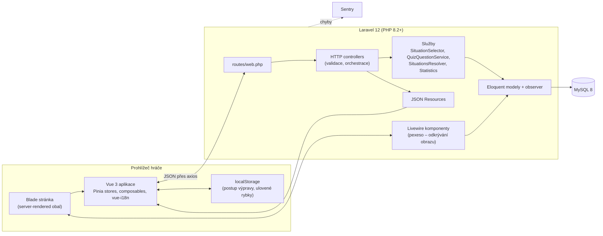
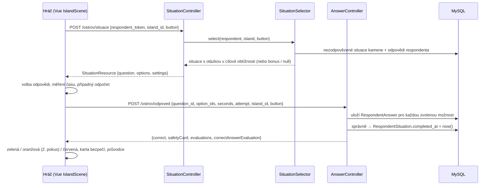
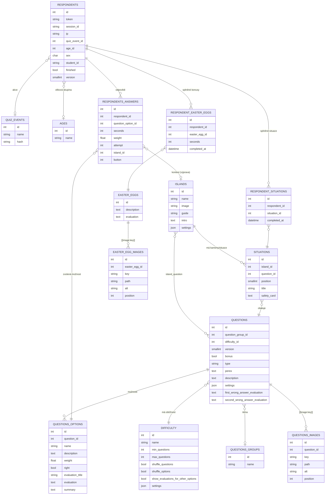

# Labyrinty kritického myšlení – technická dokumentace

| | |
|---|---|
| Software | Labyrinty kritického myšlení (Lakrim) |
| Verze dokumentu | 1.0, září 2026 |
| Odpovídá stavu kódu | větev `master`, commit `4d77d2e` (13. 8. 2026) |
| Repozitář | https://github.com/upol-cmtf/lakrim |
| Řešitel | Cyrilometodějská teologická fakulta UP v Olomouci, ve spolupráci s AU3V ČR, podpora TA ČR |

## 1. Účel dokumentu

Dokument popisuje, jak byl software navržen, jaké principy byly uplatněny, jaké má datové
struktury, architekturu a rozhraní. Je určen hodnotitelům výsledku typu R (software),
správcům aplikace a vývojářům, kteří ji budou dále rozvíjet. Doplňují ho *Analýza funkčních
požadavků* (`docs/analyza-funkcnich-pozadavku.md`), uživatelská příručka a popis ověření
funkčnosti (samostatné dokumenty).

## 2. Přehled systému

Lakrim je webová vzdělávací hra (serious game) pro seniory zaměřená na rozpoznávání
podvodných, manipulačních a dezinformačních praktik v digitálním prostředí. Hráč řeší
modelové situace, volí reakci a dostává okamžitou, situaci šitou zpětnou vazbu. Aplikace
zároveň slouží jako výzkumný nástroj: každou odpověď ukládá s časem, pořadím pokusu
a kontextem, ve kterém padla, pro následné výzkumné vyhodnocení.

### 2.1 Aktéři

| Aktér | Popis |
|---|---|
| Hráč (respondent) | Anonymní návštěvník, typicky senior. Nemá účet, identifikuje ho náhodný token. |
| Lektor / organizátor akce | Rozdává hráčům odkaz s identifikátorem akce (`hash`), aby šly výsledky skupiny seskupit. |
| Výzkumník | Vyhodnocuje uložená data o odpovědích respondentů (mimo veřejnou část aplikace). |
| Správce obsahu (vývojář) | Přidává a upravuje herní obsah formou datových migrací. |

### 2.2 Tři herní režimy nad jedním jádrem

Aplikace obsahuje tři režimy, které sdílejí datový model otázek, model respondenta,
ukládání odpovědí. Režim je dán hodnotou výčtu `App\Enums\Version`:

| Verze | Režim | Vstupní URL | Frontend | Princip |
|---|---|---|---|---|
| 1 | Znalostní kvíz | `/kviz/{hash?}` | Vue `QuizForm` | Lineární průchod pevně danou sadou otázek typu `select` (jedna volba). |
| 2 | Pexeso | `/pexeso/{hash?}` | Vue `QuestionsTiles` + Livewire `RevealingImage` | 16 políček, za správnou odpověď se odkryje část obrazu. Otázky typu `select` i `multiselect`, až dva pokusy. |
| 3 | Dobrodružná výprava | `/ostrov/{hash?}` | Vue `IslandScene` | Nelineární hra na mapě se 4 ostrovy a 20 kameny; adaptivní obtížnost, karty bezpečí, bonusové otázky, easter eggy, obnovení rozehrané hry. |

## 3. Architektura

### 3.1 Vrstvy



Architektura je třívrstvá s tenkými kontrolery a doménovou logikou ve službách:

- **Prezentační vrstva.** Blade šablony vykreslí stránku a předají Vue komponentě
  startovní data (token respondenta, seznam ostrovů, URL endpointů). Vue komponenta pak
  řídí celý průběh hry a s serverem komunikuje JSON požadavky. Pexeso navíc používá
  Livewire pro server-rendered mřížku odkrývaného obrazu.
- **Aplikační vrstva.** Kontrolery validují vstup (Laravel validator), načtou respondenta
  podle tokenu a delegují na služby. Odpovědi se serializují přes `JsonResource`.
- **Doménová vrstva.** Služby v `app/Services` nesou herní pravidla: adaptivní výběr situace,
  výběr otázky lineárního kvízu, přehled postupu a statistiky. Modely nesou vztahy,
  přetypování a pomocné dotazy; `RespondentAnswerObserver` označí dotazník za dokončený.
- **Datová vrstva.** MySQL 8, schéma i herní obsah spravují migrace.

### 3.2 Průběh jednoho tahu ve výpravě



### 3.3 Technologický stack

| Oblast | Technologie | Verze |
|---|---|---|
| Jazyk / framework | PHP, Laravel | 8.2+ / 12.x |
| Reaktivní server-side UI | Livewire | 3.x |
| Databáze | MySQL | 8.0 |
| Frontend | Vue 3, Pinia, vue-i18n, mitt (event bus), axios | 3.x / 2.x / 11.x |
| Styly | Tailwind CSS 3, Sass | |
| Build | Vite 5, laravel-vite-plugin | |
| Monitoring | Sentry Laravel SDK | 4.x |
| Kvalita | PHPUnit 11, PHPStan/Larastan (level max), PHP_CodeSniffer + Slevomat | |
| CI | GitHub Actions (phpstan, phpcs, testy, merge do `staging`) | |

### 3.4 Struktura repozitáře

```
app/
  Enums/                       Version, Difficulty, QuestionType, Sex
  Exceptions/                  MaximumQuestionsExceeded, QuestionNotFound
  Http/Controllers/Web/Quiz    endpointy kvízu + společné endpointy respondenta
  Http/Controllers/Web/QuizGrid, Web/IslandGame
  Http/Resources/Web           JSON serializace (Question, Situation, EasterEgg, …)
  Livewire/Web                 RevealingImage, RevealingImageItem (pexeso)
  Models/                      Eloquent modely
  Observers/                   RespondentAnswerObserver
  Services/                    doménová logika
database/migrations/           schéma + datové migrace s herním obsahem
resources/js/web/              Vue aplikace (components, composables, stores, i18n, services)
resources/views/               Blade (layouts, web, livewire)
resources/lang/cs/             serverové překlady
public/images, public/videos   grafika ostrovů, situací, easter eggů; videa
tests/Unit, Feature, Integration
```

## 4. Datový model

### 4.1 ER diagram



### 4.2 Popis entit

**Obsahové entity**

| Tabulka | Význam |
|---|---|
| `islands` | Čtyři tematické ostrovy výpravy. `image` a `guide` jsou názvy WebP souborů (ostrov, postava průvodce), `intro` je HTML úvodní řeč průvodce. |
| `situations` | Herní kámen ostrova. `position` 1–5 je index kamene, na jeden kámen připadá více situací (baterie otázek různé obtížnosti). `safety_card` je text karty bezpečí udělené za správné vyřešení. Bonusové otázky situaci nemají; obalují se dočasnou, neuloženou instancí. |
| `questions` | Otázka / modelová situace. `version` určuje režim, `difficulty_id` obtížnost 1–3, `bonus` označuje odměnové otázky výpravy, `type` je `select` nebo `multiselect`. `description` může obsahovat zástupné značky `[[image:key]]`. `first_/second_wrong_answer_evaluation` je vysvětlení po prvním, resp. druhém neúspěšném pokusu. `settings` nese volitelné parametry (viz 7.2). |
| `questions_options` | Možnost odpovědi s příznakem `right`, váhou `weight`, individuálním vyhodnocením (`evaluation_title`, `evaluation`) a větou do závěrečného shrnutí (`summary`). Otázka může mít více správných možností. |
| `questions_images` | Obrázky vkládané do textu otázky přes `[[image:key]]`. |
| `questions_groups` | Tematické okruhy (např. „E-mail od banky“, „Vnuk v nesnázích“, „Hoax“). Ve výpravě jsou otázky bez skupiny, téma nese ostrov. |
| `difficulty` | Tři řádky (1 lehké, 2 střední, 3 těžké). Tabulka má dvojí roli: u otázek udává obtížnost, u režimů 1 a 2 řádek se stejným `id` jako `version` nese nastavení běhu (`max_questions`, míchání otázek a možností, zobrazení vyhodnocení ostatních možností). |
| `easter_eggs`, `easter_egg_images` | Oddechové bonusové úkoly (hledání rozdílů apod.) reprezentované rybkami v moři. Zadání i vyhodnocení jsou HTML s `[[image:key]]`. |
| `quiz_events` | Akce (přednáška, kurz). `hash` je veřejný identifikátor v URL. |
| `ages` | Věkové skupiny pro dobrovolnou sebeidentifikaci. |

**Entity respondenta a sběru dat**

| Tabulka | Význam |
|---|---|
| `respondents` | Jeden herní běh. `token` (UUID v4) je jediný identifikátor, kterým frontend respondenta prokazuje. `version` říká, ve kterém režimu běh vznikl. `finished` nastaví observer po zodpovězení maximálního počtu otázek. `sex`, `age_id`, `student_id` jsou dobrovolné. |
| `respondents_answers` | Jedna zvolená možnost. `seconds` je čas od zobrazení otázky, `attempt` pořadí pokusu (1 nebo 2), `island_id` a `button` kontext ve výpravě. U `multiselect` vzniká řádek pro každou zvolenou možnost. |
| `respondent_situations` | Kámen splněný respondentem (`completed_at`). Základ pro obnovení postupu a pro počty karet bezpečí. |
| `respondent_easter_eggs` | Splněný bonusový úkol včetně času stráveného v úkolu. |

### 4.3 Zásady návrhu datového modelu

- **Oddělení obsahu a běhu.** Obsahové tabulky se mění jen migracemi, tabulky respondenta
  jen za běhu. Vyhodnocení je proto reprodukovatelné a obsah verzovaný spolu s kódem.
- **Jedna banka otázek pro tři režimy.** Režimy sdílejí `questions` a `questions_options`,
  liší se hodnotou `version`. Výsledky ze všech režimů jsou v jedné tabulce odpovědí
  a vyhodnocují se jednotně.
- **Odpověď jako událost, ne stav.** Ukládá se každá volba včetně neúspěšných pokusů,
  což umožňuje analyzovat chování (čas, druhý pokus), ne jen výsledek.
- **Situace jako vazba otázky na herní prostor.** Otázka je znovupoužitelný obsah, situace
  ji umisťuje na konkrétní kámen ostrova a přidává kartu bezpečí.

## 5. Herní principy a algoritmy

### 5.1 Anonymní respondent a token

Při vstupu do režimu vytvoří kontroler nového respondenta s náhodným UUID tokenem, uloží
identifikátor akce z URL a předá token frontendové komponentě. Každý další požadavek
token nese v těle a server jím respondenta dohledá (validace `exists:respondents,token`).
Nepoužívají se účty, e-maily ani cookies s osobními údaji; ukládá se IP adresa
a identifikátor session. Ve výpravě se token navíc drží v serverové session pod klíčem
`island_game_respondent_token`, aby se hráč po návratu na úvodní stránku vrátil ke svému
postupu (viz 5.6).

### 5.2 Adaptivní výběr situace (výprava)

Implementace: `app/Services/IslandGame/SituationSelector.php`, testy
`tests/Feature/Web/IslandGame/SituationTest.php`.

Cílem je nabízet hráči situace na hranici jeho schopností: silnému hráči těžší, slabšímu
lehčí, a to plynule napříč ostrovy, bez skoků po jedné chybě.

**Vstup:** respondent, ostrov, index kamene `button` (1–5).
**Výstup:** situace s otázkou, kterou hráč ještě neřešil, nebo `null`, když na kameni nic nezbývá.

1. **Kandidáti.** Vyberou se situace daného ostrova a kamene, jejichž otázka není bonusová
   a kterou respondent ještě nezodpověděl (množina zodpovězených otázek se odvozuje
   z uložených odpovědí). Prázdná množina → `null`.
2. **Odměna za sérii.** Spočítá se *série* `s` = počet po sobě jdoucích správných odpovědí
   na první pokus, počítáno od poslední odpovědi zpět (chyba sérii nuluje). Povolený počet
   bonusů `b(s)` je 0 pro `s < 3`, 1 pro `3 ≤ s < 6`, 2 pro `s ≥ 6`, nejvýše 2 za hru.
   Pokud respondent dosud dostal méně bonusů než `b(s)`, vrátí se náhodná dosud
   nezodpovězená bonusová otázka verze 3, obalená dočasnou situací pro daný kámen.
   Bonus se tedy neváže na obsah kamene a rozprostře se do hry (nejdříve po 3., pak po 6.
   správné odpovědi v řadě).
3. **Skóre znalostí.** Přes všechny odpovědi respondenta na první pokus (napříč ostrovy,
   v pořadí vzniku) se počítá `score`: správná +1, špatná −1, po každém kroku
   `score = max(0, score)`. Cílová obtížnost `t` je 1 pro `score < 2`, 2 pro `2 ≤ score < 4`,
   3 pro `score ≥ 4`.
4. **Výběr podle obtížnosti.** Prohledá se preference `[t, t−1, …, 1, t+1, …, 3]`; v první
   neprázdné skupině kandidátů se vybere náhodně. Preferuje se tedy nejbližší nižší
   obtížnost před vyšší, aby hráč nebyl přetížen.

Vlastnosti ověřené testy: po dostatečném počtu správných odpovědí přichází těžší otázka;
jedna chyba nesrazí hráče na lehkou úroveň; opakované chyby úroveň postupně snižují;
skóre neklesne pod nulu; započítávají se odpovědi ze všech ostrovů; při nedostupnosti
cílové obtížnosti se sáhne po nejbližší nižší; bonus přijde po sérii a nejvýše dvakrát.

Parametry (prahy skóre 2 a 4, prahy série 3 a 6, maximum 2 bonusy) jsou konstanty třídy
a lze je měnit bez zásahu do zbytku systému. Složitost je lineární v počtu odpovědí
respondenta (desítky řádků), dotazy jsou omezené na jednoho respondenta a jeden kámen.

### 5.3 Dvoupokusové vyhodnocení, karty bezpečí a průvodce

Implementace: `app/Http/Controllers/Web/IslandGame/AnswerController.php`,
`resources/js/web/components/IslandGame/composables/useQuestionFlow.js`.

- Odpověď je **správná**, když všechny zvolené možnosti jsou označené jako správné.
  Situace může mít víc přijatelných reakcí; stačí zvolit některou z nich.
- Po **prvním špatném pokusu** dostane hráč vysvětlení k zvolené možnosti, text
  `first_wrong_answer_evaluation`, kámen zežloutne (oranžová) a hráč může zkusit jinou
  možnost; špatně zvolená možnost se zablokuje.
- Po **druhém špatném pokusu** se zobrazí `second_wrong_answer_evaluation`, kámen
  zčervená a situace se uzavře; další kámen se odemkne, aby hráč nezůstal zablokovaný.
- Po **správné odpovědi** se situace označí jako splněná, hráč získá **kartu bezpečí**
  (krátká zapamatovatelná zásada, například jak reagovat na výzvu k platbě), která
  vyskočí jako toast a přidá se na nástěnku v majáku. Bonusová otázka bez vlastní karty
  uděluje univerzální kartu o rozpoznání bezpečné situace.
- Volitelný **časový limit** (`settings.time_limit` v sekundách) se zobrazuje jako odpočet;
  po vypršení se odpověď vyhodnotí jako neúspěšný pokus.
- **Průvodce** ostrova komentuje průběh v bublině (úvod, úspěch, výzva k druhému pokusu,
  neúspěch). Texty jsou v `resources/js/web/i18n/locales/cs.js`.

Barevný stav kamenů (`locked`, `default`, `green`, `orange`, `red`) je jediným zdrojem
pravdy pro odemykání: kameny se odemykají postupně a odemčení nezávisí na správnosti.

### 5.4 Lineární kvíz (verze 1)

Implementace: `app/Services/Quiz/QuizQuestionService.php`, `RespondentAnswerObserver`.

Nastavení běhu (počet otázek, míchání) se čte z řádku tabulky `difficulty` odpovídajícího
verzi. Služba vrací první (nebo náhodnou, je-li zapnuto míchání) dosud nezodpovězenou
otázku dané verze; po dosažení `max_questions` vyhodí `MaximumQuestionsExceededException`,
kterou kontroler přeloží na HTTP 400 s kódem `maximum_questions_exceeded`. Observer po
každé uložené odpovědi ověří, zda respondent zodpověděl maximum, a nastaví `finished`.
Závěrečné shrnutí (`RespondentSummaryController`) spočítá úspěšnost a seskupí věty
`summary` zvolených možností do bloků „zvládli jste“ a „na co si dát pozor“.

### 5.5 Pexeso (verze 2)

Frontend `QuestionsTiles.vue` drží stav 16 políček ve store `QuestionsTilesStore`
(zodpovězeno, správně, špatně, pokus). Otázky typu `multiselect` vyžadují označit všechny
správné možnosti; shrnutí používá šablonu `settings.multiselectSummary` s zástupnými
`:totalSelected` a `:totalRight`. Livewire komponenta `RevealingImage` přijímá událost
`answered` a odkrývá odpovídající dílek obrazu; po odkrytí všech dílků je hra dokončena.

### 5.6 Obnovení rozehrané výpravy

Server drží token rozehraného respondenta v session (klíč `island_game_respondent_token`).
Při návratu na `/ostrov` se použije stejný respondent, pokud odpovídá i akce v URL; jinak
vznikne nový. „Začít znovu“ (`/ostrov-znovu`) token ze session zahodí. Na straně
prohlížeče se pod klíčem svázaným s tokenem drží v `localStorage` vizuální postup
(stavy kamenů, karty bezpečí) a ulovené rybky; při startu nového tokenu se cizí klíče
smažou. Autoritativní postup (splněné situace) je vždy v databázi a frontend si ho může
dotáhnout přes `/kviz/respondent/situations`.

### 5.7 Bonusové úkoly (easter eggy) a rybky

Počet rybek ve scéně se rovná počtu záznamů v `easter_eggs`. Kliknutí na rybku načte
první nesplněný úkol respondenta (`/kviz/easter-egg`), po zavření se uloží splnění
s časem (`/kviz/respondent/easter-egg`) a rybka se přesune do koše v majáku, odkud lze
úkol znovu prohlížet bez logování. Rybky jsou při pauze (intro tour) zastavené a rozmístěné
tak, aby neplavaly společně.

### 5.8 Obrázky v textu

Texty otázek a bonusových úkolů obsahují zástupné značky `[[image:key]]`. Model je při
serializaci nahradí HTML značkou `` s URL z `questions_images`, resp.
`easter_egg_images` (`Question::renderedDescription()`, `EasterEgg::renderedDescription()`).
Obsah se tak ukládá bez absolutních cest a obrázky lze měnit nezávisle na textu.

## 6. Rozhraní

### 6.1 Veřejné stránky

| Metoda | Cesta | Popis |
|---|---|---|
| GET | `/` | Rozcestník režimů; nabídne pokračování rozehrané výpravy. |
| GET | `/kviz/{hash?}` | Založí respondenta verze 1 a vykreslí kvíz. |
| GET | `/pexeso/{hash?}` | Založí respondenta verze 2 a vykreslí pexeso. |
| GET | `/ostrov/{hash?}` | Založí nebo obnoví respondenta verze 3 a vykreslí výpravu. |
| GET | `/ostrov-znovu` | Zahodí rozehranou výpravu ze session a přesměruje na `/ostrov`. |
| GET | `/kviz/dokonceni`, `/kviz/podekovani` | Závěrečné stránky. |
| GET | `/v1/kviz/{hash?}` | Zpětně kompatibilní vstup do kvízu (starší odkazy). |

### 6.2 JSON endpointy hry

Všechny přijímají a vracejí JSON, jsou chráněné CSRF tokenem (meta značka v layoutu,
axios ho posílá automaticky) a vyžadují `respondent_token`. Odpověď je obalená v klíči `data`.

| Metoda | Cesta | Vstup | Výstup |
|---|---|---|---|
| GET | `/kviz/age-list` | – | seznam věkových skupin `{id, name}` |
| POST | `/kviz/question` | `respondent_token`, `version` | otázka `{id, perex, description, type, options[{id,name,description}], settings, group}`; 400 `maximum_questions_exceeded` / `question_not_found` |
| POST | `/kviz/answer` | `respondent_token`, `question_id`, `option_ids[]`, `seconds`, `attempt` | `{end, evaluations[{optionId, evaluation, evaluationTitle, rightAnswer}], correctAnswerEvaluation}` |
| POST | `/kviz/respondent/identification` | `respondent_token`, `sex?`, `age_id?` | 204 |
| POST | `/kviz/respondent/student-id` | `respondent_token`, `student_id` | 204 |
| POST | `/kviz/respondent/summary` | `respondent_token` | `{statistics{totalQuestions, correctAnswers, percentageCorrectAnswers, …}, evaluation{right[], wrong[]}}` |
| POST | `/kviz/respondent/situations` | `respondent_token` | ostrovy se situacemi a příznakem `completed` |
| POST | `/kviz/easter-egg` | `respondent_token` | první nesplněný bonusový úkol `{id, description, evaluation}` nebo `null` |
| POST | `/kviz/respondent/easter-egg` | `respondent_token`, `easter_egg_id`, `seconds` | `{completed: true}` |
| POST | `/ostrov/situace` | `respondent_token`, `island_id`, `button` (1–5) | `{id, position, title, question}`; 404 `no_situation_available` |
| POST | `/ostrov/odpoved` | `respondent_token`, `question_id`, `option_ids[]`, `seconds`, `attempt`, `island_id`, `button` | `{correct, safetyCard, evaluations[], correctAnswerEvaluation}` |

Validace možností kontroluje, že každá `option_id` patří k dané otázce. Chybná validace
vrací HTTP 422 se standardní strukturou Laravelu.

### 6.3 Rozhraní frontend ↔ Blade

Blade předává Vue komponentám vše potřebné jako atributy, takže frontend nezná routy
napevno: `respondent-token`, `situation-url`, `answer-url`, `easter-egg-url`,
`respondent-easter-egg-url`, `completion-url`, `home-url`, `completion-video-url`,
`islands-data` (JSON), `easter-eggs-count`, `settings` (JSON s `maxQuestions`,
`showEvaluationsForOtherOptions`, `requireStudentId`). Kvízové endpointy používá klient
`resources/js/web/services/QuizAPI.js` nad základní URL `VITE_QUIZ_API_URL`.

## 7. Frontend

### 7.1 Struktura

| Část | Soubory | Odpovědnost |
|---|---|---|
| Vstup | `resources/js/web/app.js` | Vytvoří Vue aplikaci, Pinia, i18n, event bus; registruje kořenové komponenty. |
| Výprava | `components/IslandGame/IslandScene.vue` + `components/*` | Scéna moře, mapa ostrovů, detail ostrova, modal otázky, maják (kontakty, karty bezpečí, koš), rybky, intro tour, závěrečný panel s videem. |
| Composables výpravy | `composables/useIslands`, `useQuestionFlow`, `useSafetyCard`, `useGuide`, `useSeaFish`, `useEasterEggs`, `useLighthouseModals`, `assets` | Každý drží jednu oblast stavu a logiky; `IslandScene` je jen skládá. |
| Kvíz | `components/Quiz/*`, stores `QuestionStore`, `QuizStatusBarStore`, `OptionEvalutationStore`, `RespondentIdentificationStore`, `QuizSettingsStore`, `RespondentTokenStore` | Průchod otázkami, progress bar témat, identifikace respondenta, závěr. |
| Pexeso | `components/QuizGrid/*`, store `QuestionsTilesStore` | Mřížka políček, detail otázky, vyhodnocení, spolupráce s Livewire přes událost `answered`. |
| Lokalizace | `i18n/locales/cs.js` | Veškeré texty výpravy (průvodce, tour, maják, karty), HTML v textech se vykresluje přes `v-html`. |

### 7.2 Nastavení otázky (`questions.settings`)

| Klíč | Režim | Význam |
|---|---|---|
| `time_limit` | výprava | Limit na odpověď v sekundách; zobrazí odpočet. |
| `actionTitle` | pexeso | Nadpis nad možnostmi (výchozí „Co uděláte?“). |
| `actionPerex` | pexeso | Doplňující instrukce nad možnostmi. |
| `multiselectSummary` | pexeso | Šablona shrnutí u `multiselect` (`:totalSelected`, `:totalRight`). |

### 7.3 Přístupnost a cílová skupina

Rozhraní je navržené pro seniory: velká tlačítka a písmo, vysoký kontrast, jednoduché
kroky, průvodce s jasnými pokyny, možnost druhého pokusu bez penalizace, intro tour
s možností přeskočení, funkční rozložení na mobilu naležato i na výšku, `aria-label`
u ikonových ovládacích prvků, zoom obrázků ze zadání.

## 8. Správa obsahu

Herní obsah se zadává datovými migracemi (`database/migrations/*seed*`), které vytvářejí
otázky, možnosti, obrázky a situace v transakci a mají implementované `down()`. Zdrojem
byly scénáře odborného týmu (dokumenty DOCX), ze kterých se obsah importoval. Standardní
osazení výpravy: 4 ostrovy × 5 kamenů × 3 obtížnosti (15 situací na ostrov), sada
bonusových otázek a 5 bonusových úkolů. Události kvízu se zakládají migrací
(např. 20 událostí AU3V s maskou `au3v-XX??`). Grafika je v `public/images` ve formátu
WebP, videa v `public/videos`.

## 9. Bezpečnost a ochrana dat

- Hra nevyžaduje registraci ani osobní údaje; identifikace pohlavím, věkovou skupinou
  a studijním číslem je dobrovolná. Ukládá se IP adresa a identifikátor session.
- Respondenta autorizuje pouze náhodný UUID token; endpointy nikdy nevrací data jiného
  respondenta.
- Všechny vstupy procházejí validací (typ, existence v DB, vazba možnosti na otázku,
  rozsah kamene 1–5).
- Formuláře a JSON požadavky chrání CSRF token.
- Chyby se hlásí do Sentry, aplikační log neobsahuje obsah odpovědí.
- Texty obsahu obsahující HTML pochází výhradně z migrací (důvěryhodný zdroj), nikdy od
  uživatele.

## 10. Nasazení a provoz

1. Nastavit `.env` (`APP_URL`, `APP_NAME`, `DB_*`, `VITE_QUIZ_API_URL="${APP_URL}/kviz"`,
   `SENTRY_LARAVEL_DSN`, `SESSION_DRIVER`).
2. `composer install --no-dev --optimize-autoloader`, `npm ci && npm run build`.
3. `php artisan migrate --force` (schéma i obsah), `php artisan config:cache route:cache view:cache`.
4. Webserver směřuje na `public/`; zapisovatelné `storage/` a `bootstrap/cache/`.

CI v GitHub Actions spouští PHPStan, PHP_CodeSniffer a testy nad MySQL službou pro každý
pull request a po úspěchu slučuje `feature/*` a `bugfix/*` větve do `staging`.

## 11. Kvalita kódu a ověřitelnost

- **Statická analýza:** PHPStan (Larastan) na úrovni `max`, generika povolena bez anotace.
- **Styl:** PHP_CodeSniffer s vlastním standardem (`phpcs-standard.xml`, Slevomat).
- **Testy:** PHPUnit, tři sady (Unit, Feature, Integration), 99 testů. Pokrývají
  všechny JSON endpointy včetně validace, adaptivní výběr situací (11 scénářů), bonusy,
  easter eggy, obrázky v textu a shrnutí.
- **Verzování:** git tagy `1.x` (kvíz) a `2.x` (pexeso); vývoj přes pull requesty.

## 12. Prvky, které odlišují návrh od běžné kvízové aplikace

1. **Adaptivní obtížnost napříč nelineární mapou.** Skóre znalostí se počítá globálně,
   ne po ostrovech, s asymetrickým tlumením (nikdy pod nulu, preference nižší obtížnosti
   při fallbacku). Hráč tak může volit ostrovy libovolně a přesto dostává úlohy na míru.
2. **Odměna za sérii jako pedagogický nástroj.** Bonusové otázky nejsou obsah kamene,
   ale přerušení rutiny při úspěchu; jejich rozložení (po 3 a 6 správných) je řízené
   a omezené, aby nenarušovalo výzkumnou srovnatelnost.
3. **Dvoupokusová zpětná vazba s odděleným vysvětlením** po prvním a druhém neúspěchu
   a s blokací už zvolené možnosti, navržená pro cílovou skupinu, která potřebuje
   bezpečné prostředí pro chybu.
4. **Karta bezpečí jako jednotka učení.** Každá situace končí krátkou přenositelnou
   zásadou, sbírky karet tvoří „nástěnku“ a jsou zároveň měřitelným ukazatelem postupu.
5. **Sběr dat na úrovni pokusu** (čas, pokus, kontext kamene, váha) v jedné tabulce pro tři
   odlišné herní režimy nad jednou bankou otázek, což umožňuje srovnávat účinnost režimů.
